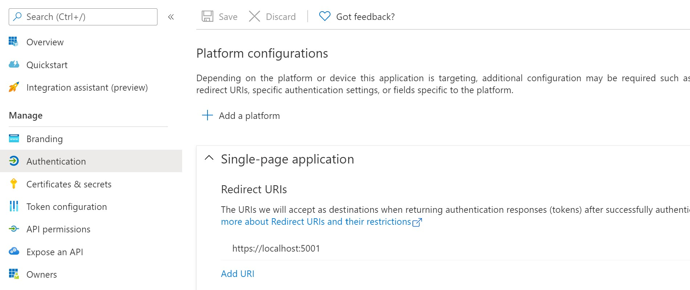
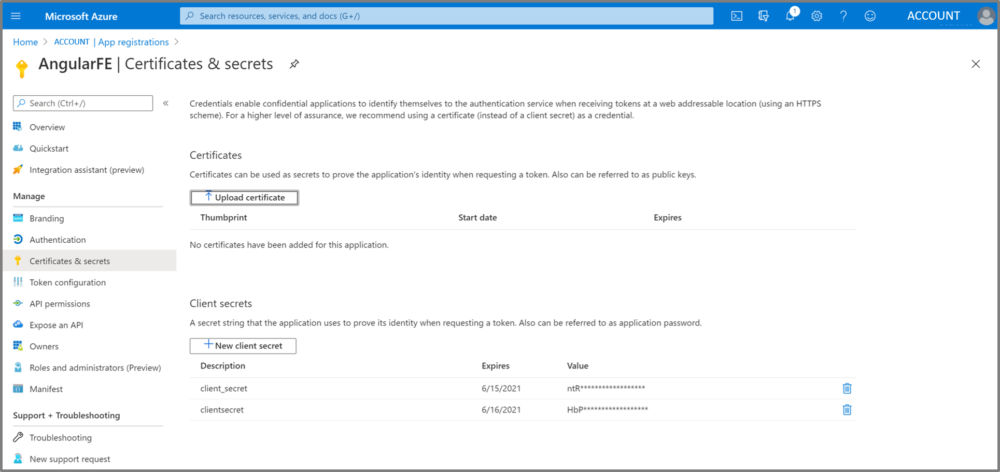
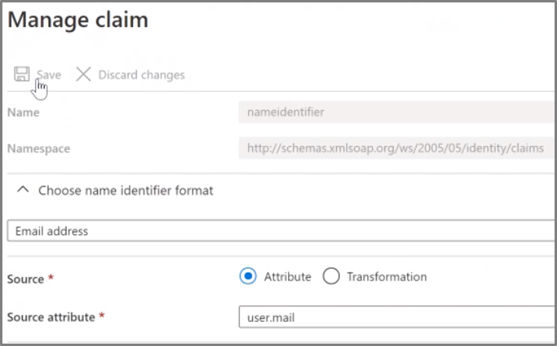

# Azure Active Directory Configuration

In this part we will configure Azure Active Directory (Azure AD) to be the working Identity Provider (IDP) for the frontend Azure Client Application (AngluarFE), API Application, and SAP backend service (option 1: SAP NetWeaver, option 2: SAP Cloud Platform).

## Introduction

The following steps register the three applications in Azure AD:

1. The first app registration for the frontend web app enables a frontend for the user to authenticate on.
1. The second app registration for the API app delegates the authentication of the user between Azure AD and SAP. It needs to be configured to authenticate the user (Jane Doe, jdoe@contoso.com) and get an **access token** (issued by Azure AD) with the OAuth2 Implicit Flow.
1. The enterprise app registration represents SAP with the backend service and is required to support the On-behalf-of (OBO) flow to request the SAML assertion. This app will be registered as an enterprise application from the Azure AD Gallery, either of type *SAP NetWeaver (Option 1)* or *SAP Cloud Platform (Option 2)*. This enables the exchange of an **OAuth 2.0 Access Token** with a **SAML 2.0 Assertion** (both issued by Azure AD) using the OBO flow .

## Register Frontend Application (Client App)

1. Go to portal.azure.com
1. Navigate to **Azure Active Directory** via the menu or the global search
1. Select **App registrations** in the left bar
1. Create a **+ New registration**
1. Insert a **name** e.g. *AngularFE* and leave all the settings as **default**
1. Select **Register**
1. Save the application (client) ID to a notepad. As we will have a bunch of ids in the Postman scenario, try to label each while saving it to the notepad.


### Configure the authentication settings of the Frontend Application

1. As next step we need to configure the authentication of the client app. Hit the **Authentication** button on the left bar.
1. Click **Add a platform**
1. Choose the **Single-page application**
1. Insert the redirect uri as shown in the image below. This address is used as the destination when returning authentication responses (tokens) after successfully authenticating users.
    ```http
    https://localhost:5001
    ```
    
1. In addition to this activate the checkboxes **Access tokens**.
1. Click **Configure**
1. Check **Accounts in any organizational directory (Any Azure AD directory - Multitenant)**.
1. Click **Save**.

### Add a Client Secret

Credentials enable confidential applications to identify themselves to the authentication service when receiving tokens at a web addressable location (using an HTTPS scheme). A secret is a string that the application uses to prove its identity when requesting a token.

1. Select the menu item **Certificates & secrets**.
1. Add a **+ New client secret**.
1. Copy the value of the client secret into a notepad.



### Expose an API of the Client Application

1. Now you need to expose the API by defining the scope for the implicit grand flow. Navigate to **Expose an API**.
1. Click **+ Add a scope** to define a custom scopes to restrict access to data and functionality protected by the API. 
1. You are required to set the **Application ID URI** which can be set to the proposed default value (```api://<CLIENT_APP_ID>```).
1. An application that requires access to parts of this API can request that a **user or admin has to consent** to one or more of these scopes. Check **Admins and Users**. For the scope name you may choose ```read```. You are free to enter more a descriptive name and consent descriptions.
1. After the changes hit **Save**.


## Register API Application

For the implicit grant flow you need to get an access token from the Azure Active Directory using an API application.

1. Navigate to **Azure Active Directory** via the menu or the global search
1. Select **App registrations** in the left bar
1. Create a **New registration**
1. Insert a **name** e.g. *API App* and leave all the settings as **default**
1. Select **Register**
1. Save the application (client) ID to a notepad

    

### Configure the authentication settings of the API Application

1. As next step we need to configure the authentication of the API app. Hit the **Authentication** button on the left bar.
1. **Add the plattform** and choose the **Web** Template
    
1. Enter for the redirect URI
    ```http
    https://localhost:5001
    ```
1. Check the boxes of **Access tokens** and **ID tokens**.
1. After all these changes hit **Configure**.
    

### Add a Client Secret for the Client Application

1. Select the button **Certificates & secrets**.
1. Add a **New client secret**.
1. Copy the value of the client secret to a notepad.

### Expose an API of the API Application

1. Now we need to expose our API by defining the scope for the implicit grand flow. Navigate to **Expose an API**.
1. Click **+ Add a scope** and accept the **default** value in the **Application ID URI**. Click **Save and continue**.
1. Enter a scope name ```impersonate``` and check the box **Admins and Users**. Enter a consent description and click **Add scope**.
1. Click **+ Add a client application** and enter the **Client Applications ID** of the frontend app saved to the notepad in the last section. Check the box **Authorized scopes**.
1. After the changes hit **Add application**.


## Option 1: Register Enterprise Application (Backend: SAP NetWeaver)

To get access to the SAP OData Services seamlessly we configure the Azure Active Directory using a SAP NetWeaver as enterprise application.
This is important due to the goal and ability of enabling Single Sign On.

Proceed with the following steps:

1. Navigate to **Enterprise applications** under **Azure Active Directory**
1. Create a **New application**
1. Search for **SAP NetWeaver** and **Add** the selected application.
1. Save the Application (client) ID to a notepad.


### Configure Single Sign-On (Basic SAML Configuration)

1. Select **Single sign-on** in the left bar.
1. Select the **SAML** tile
1. Click on the **Edit** Button of the **Basic SAML Configuration** Tab. 
1. Please insert an **Entity ID** should be equal to the **Provider-Name** of your SAP NetWeaver
1. Please insert the following Reply URLs:

    ```http
    https://<SAP-IP-ADDRESS>:44300/sap/bc/sec/oauth2/token
    https://<SAP-IP-ADDRESS>:44300/sap/saml2/sp/asc/100
    ```

1. Insert the following Sign on URL

    ```http
    https://<SAP-IP-ADDRESS>:44300/sap/bc/ui5_ui5/ui2/ushell/shells/abap/FioriLaunchpad.html
    ```

1. Click **Save**.

> [!NOTE] The examples use SSL Port **44300**. If you have configured a different port in your scenario, just adapt the URLs. For the **Entity ID** you should choose the SAML **Service Provider Name** of your SAP NetWeaver system.


### Configure Single Sign-On (User Attributes & Claims)

1. Select the **Edit** button of the **User Attributes & Claims** section.
1. Select the **Unique User Identifier** from the list by clicking on the entry
1. Choose the name identifier format **Email address**, select **Attribute** and insert **user.userprincipalname** as source attribute.
1. Click **Save**.

> [!NOTE] The **Name ID** in the SAP NetWeaver system is an **email address** which is equal to the **user.userprincipalname** in Azure AD. If in your setup the **user.userprincipalname** differs from the SAP user's **email address**, choose a value from Azure AD which can be mapped correctly, e.g. **user.mail**




### Configure Single Sign-On (SAML Signing Certificate)

1. Click on the **Edit** Button of the **SAML Signing Certificate** section.
1. Import a signing Certificate. Choose as the **Signing Option** the **Sign SAML assertion** and as the **Signing Algorithm** choose **SHA-256**.
1. Click **Save**.


### Single Sign-On configuration

The final **Single Sign-On** setup should look like this:


### Configure the authentication settings

1. As next step we need to configure the authentication of the SAP NetWeaver app. Go back to the Azure AD overview and switch to the general **App registrations** on the left bar and select **All applications**. Now you should find the SAP NetWeaver App. Select it. 
1. Navigate to **Authentication** in the left bar. If not already shown: **Add a platform** and select **Web**.
1. Add the following Redirect URIs: ```https://<SAP-IP-ADDRESS>:44300/sap/saml2/sp/asc/100``` and ```https://<SAP-IP-ADDRESS>:44300/sap/bc/sec/oauth2/token```

1. Check the boxes of **Access tokens** and **ID tokens**.
1. After all these changes hit **Save**.


### Expose an API of the SAP NetWeaver application

Now we need to expose our API by defining the scope and the application id uri in the implicit grand flow.

1. Edit the Application ID URI as follows:

    ```http
    https://<SAP-IP-ADDRESS>:44300/sap/bc/sec/oauth2/token
    ```

1. **Add a scope** that looks as follows: ```https://<SAP-IP-ADDRESS>:44300/sap/bc/sec/oauth2/token/user_impersonation```
1. Set the authorized client applications by pressing **Add a client application** and adding the  **Application (client) ID** from the **API application** registered earlier and *check the box* **Authorized scopes**.  
1. After all these changes hit **Add Application**.


## Option 2: Register Enterprise Application (Backend: SAP Cloud Platform)

Accessing the Web service on SCP requires registration and configuration of SCP as an enterprise application in Azure AD, following these steps:

1. Navigate to **Enterprise applications** under **Azure Active Directory**
1. Create a **New application**
1. Search for **SAP Cloud Platform** and **Add** the selected application.
1. Next, enter a name for the new enterprise app, e.g. “SAP Cloud Platform <your trial account name>” and click **Create**.


### Configure Single Sign-On (Basic SAML Configuration)

1. For the newly created enterprise application, select the tile **2. Set up single sign on**
1. Select **SAML** tile
1. Download your SCP (trial) subaccount's SAML metadata file in a separate browser tab. The public URL follows the pattern `https://<subdomain>.authentication.<landscape>.hana.ondemand.com/saml/metadata`. For example, the SAML metadata for SCP trial account `98abcd76trial` on the `us10` SCP landscape can be downloaded from `https://98abcd76trial.authentication.us10.hana.ondemand.com/saml/metadata`
1. Click **Upload metadata file** and select the file containing your SCP subaccount’s SAML Service Provider metadata file you’ve download in previous step. Click **Add**.
1. Most of the fields in the Basic SAML Configuration are automatically populated by the uploaded metadata file, which simplifies the trust setup between Azure AD and SCP. For the **Sign on URL**, enter the value following the pattern `https://<subdomain>.authentication.<landscape>.hana.ondemand.com`, e.g. `https://98abcd76trial.authentication.us10.hana.ondemand.com`for a trial account with subdomain `98abcd76trial` on the `us10` SCP landscape. Do not save the settings yet!
1. Next, add a new **Reply URL**. This must be set to the token endpoint of your SCP OAuth server, the XSUAA (Extended Services for User Account and Authentication), to which the SAML Assertion is sent for requesting the access token. Just copy the value of the already existing reply URL (which was taken from the metadata file upload), and replace `saml/SSO` with `oauth/token` in the new URL to add.

1. After adding the new URL, activate the **Default** checkbox for it, and **delete** all other reply URL(s). This ensures that the *Recipient URL* is set correctly in the generates SAML assertion by AAD. Click **Save**.

### Configure user attributes and claims

1. Next, you will configure additional attributes of the user which will be federated between Azure AD and SCP. Click on the **pencil** symbol for **User Attributes and Claims**
1. Select the **Unique User Identifier (Name ID)** from list and change the **Source attribute** to **user.mail**. This will use the user’s email address in Azure AD as the login name (Name ID) of the subject in the generated SAML assertion. Using the email address is a best practice for a common user identifier when federating users across clouds and platforms.

1. To demonstrate federation of user attributes in the scenario, click **+ Add new claim** and enter **country** in the name field, and `http://schemas.xmlsoap.org/ws/2005/05/identity/claims` for **Namespace**. Select **user.country** for the **Source** attribute. Click **Save**.
1. Navigate back to the **Setup Single Sign-On with SAML** settings and scroll down to **SAML Signing Certificate**. Click the **Download** link for the **Federation Metadata XML**. The downloaded file will be used later to setup the trust relationship in SCP.


### Expose an API of the SAP Cloud Platform application

1. Navigate back to the **App Registrations** in the Azure AD service navigation menu. Select **All Applications** as the filter settings from the top of the list and select the application registered for the backend service in SCP (e.g. *SAP Cloud Platform <name of your trial account>*).
1. Select **Manage – Expose an API** from the navigation menu, and click **+ Add a client application**

1. Enter the **Application (client) ID** from the **API application** registered earlier and *check the box* **Authorized scopes**. This will authorize the API application to request a SAML assertion from Azure AD for the SCP backend service application.
1. Confirm with **Add application**.

## Next Steps

Continue the scenario setup based on the option you chose for the SAP backend:
Option 1: [Configuring SAP NetWeaver](../SAPNetWeaverConfiguration/README.md).
Option 2: [Configuring SAP Cloud Platform](../SAPCloudPlatformConfiguration/README.md).

## Additional resources

- [List of Tutorials on How to Integrate SaaS Apps with Azure Active Directory](https://docs.microsoft.com/azure/active-directory/active-directory-saas-tutorial-list)

- [What is application access and single sign-on with Azure Active Directory?](https://docs.microsoft.com/azure/active-directory/active-directory-appssoaccess-whatis)

- [What is conditional access in Azure Active Directory?](https://docs.microsoft.com/azure/active-directory/conditional-access/overview)

- [Try Visibly with Azure AD](https://aad.portal.azure.com/)

- [What is session control in Microsoft Cloud App Security?](https://docs.microsoft.com/cloud-app-security/proxy-intro-aad)
- https://blogs.sap.com/2020/07/17/principal-propagation-in-a-multi-cloud-solution-between-microsoft-azure-and-sap-cloud-platform-scp/