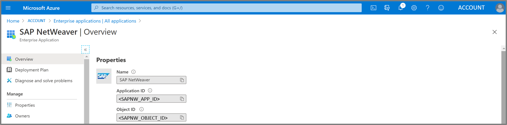
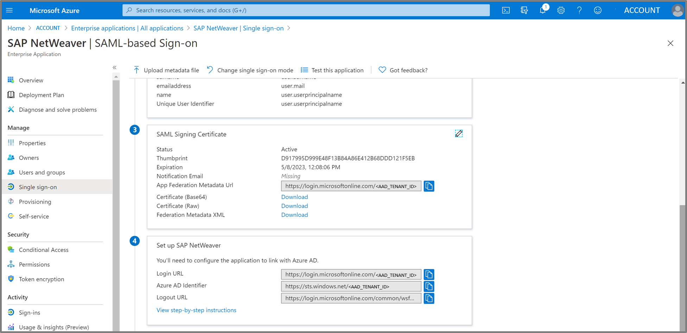
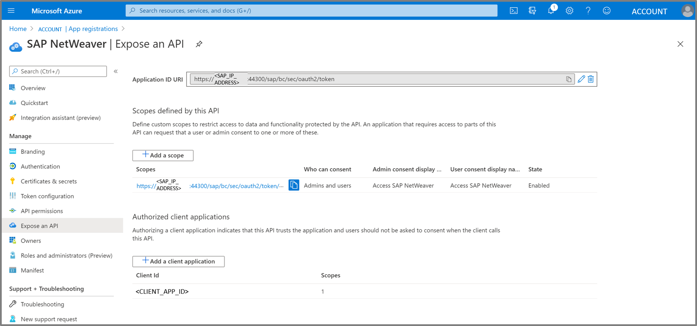

# Azure Active Directory Configuration

In this part you will configure Azure Active Directory (AAD) to be the working Identity Provider (IDP) for our Azure Application and SAP.

|Topic|Description|
|:-----------|:------------------|
|[Register Application (Client App)]()|What needs to be done|
|[Register Enterprise Application (Backend: SAP NetWeaver)]()|What needs to be done|
|[Configure registered Applications in Azure Active Directory]()|What needs to be done|

## Register Application (Client App)

For the implicit grant flow we need to get an access token from the Azure Active Directory using a client application.

As next step we need to configure the authentication of the client app. Hit the *Authentication* button on the left bar. Then insert the recirect uris. The URIs are used as destinations when returning authentication responses (tokens) after successfully authenticating users.
In addition to this please check the boxes of *Access tokens* and *ID tokens* and after all these changes hit *Save*. 

Credentials enable confidential applications to identify themselves to the authentication service when receiving tokens at a web addressable location (using an HTTPS scheme). A secret string that the application uses to prove its identity when requesting a token. 
So as next step please select the button certificates & secrets and add a new *New client secret* and don't forget to copy the value of the client secret into an local notepad.

Now we need to expose our API by defining the scope and the application id uri in the implicit grand flow. Define custom scopes to restrict access to data and functionality protected by the API. An application that requires access to parts of this API can request that a user or admin consent to one or more of these. For example you can insert as scope *api://<CLIENTAPP-ID/read*. After all these changes hit *Save*. 

## Register Enterprise Application (Backend: SAP NetWeaver)

For the on behalf of flow we need to get an SAML assertion from the Azure Active Directory using a SAP NetWeaver as enterprise application.

Please select *Single sign-on* on the left bar. You can see the following Overview of *Basic SAML Configuration*, *User Attributes & Claims* and *SAML Signing Certificate*.

Furthermore in the overview you can see the *SAML Signing Certificate* and the *Set up SAP NetWeaver*. In the following steps we will configure this enterprise application as shown in the screenshots.

Click on the *Edit* Button of the *Basic SAML Configuration* Tab. Please insert the following Reply URL: *https://SAP-IP-ADDRESS:44300/sap/bc/sec/oauth2/token* and *https://SAP-IP-ADDRESS:44300/sap/saml2/sp/asc/100*.
After all these changes hit *Save*. 

Then Click on the *Edit* Button of the *User Attributes & Claims* Tab.
Choose name identifier format *Email address*, select *Attribute* and insert as Source Attribute *user.userprincipalname*. After all these changes hit *Save*. 

Then Click on the *Edit* Button of the *SAML Signing Certificate* Tab. Import a signing Certificate. Choose as the *Signing Option* the *Sign SAML assertion* and as the *Signing Algorithm* choose *SHA-256*. After all these changes hit *Save*.  

## Configure registered Applications in Azure Active Directory

As next step we need to configure the authentication of the SAPNetweaver app. Switch to the general *App Registrations* on the left bar and select under *all Applications* the SAP NetWeaver App. Hit the *Authentication* button on the left bar. Then insert the recirect uris. The URIs are used as destinations when returning authentication responses (tokens) after successfully authenticating users. Insert the following reply urls: *https://SAP-IP-ADDRESS:44300/sap/saml2/sp/asc/100* and *https://SAP-IP-ADDRESS:44300/sap/bc/sec/oauth2/token*.
In addition to this please check the boxes of *Access tokens* and *ID tokens* and after all these changes hit *Save*. 

