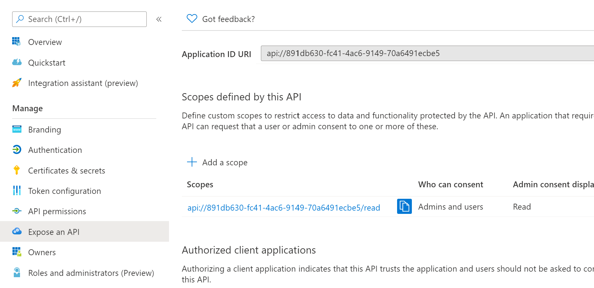
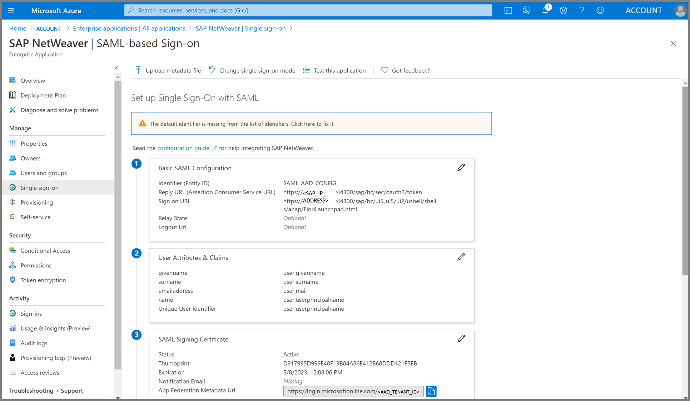

# Azure Active Directory Configuration

In this part you will configure Azure Active Directory (AAD) to be the working Identity Provider (IDP) for our Azure Application and SAP.

|Topic|Description|
|:-----------|:------------------|
|[Register Application (Client App)]()|What needs to be done|
|[Register Enterprise Application (Backend: SAP NetWeaver)]()|What needs to be done|
|[Configure registered Applications in Azure Active Directory]()|What needs to be done|

## Register Application (Client App)

## Register Enterprise Application (Backend: SAP NetWeaver)

## Configure registered Applications in Azure Active Directory

