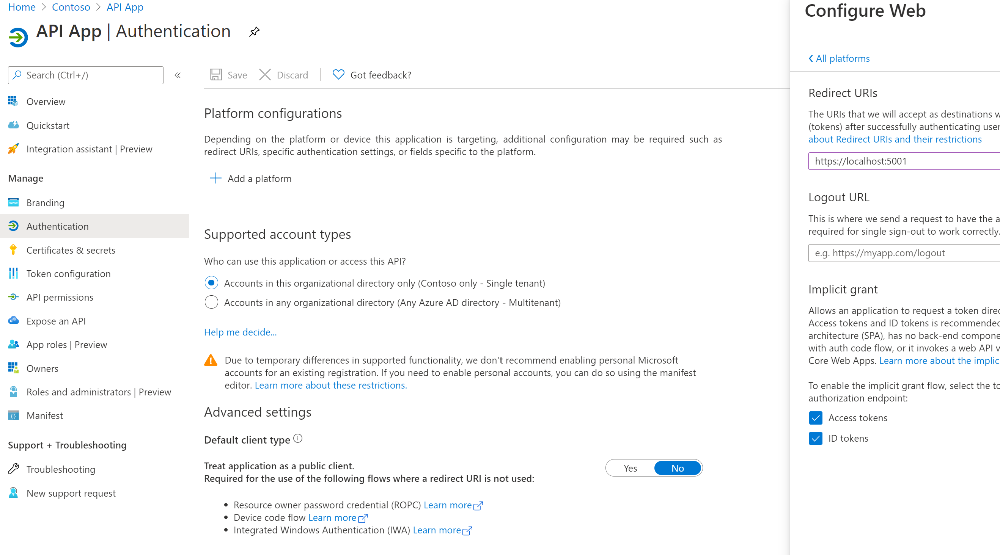
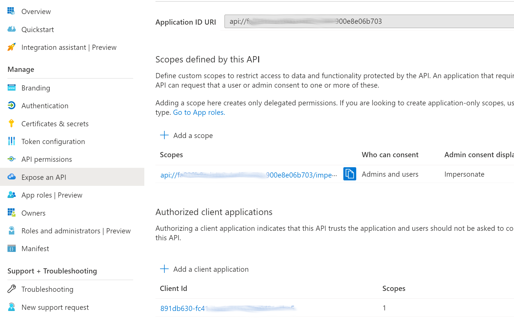
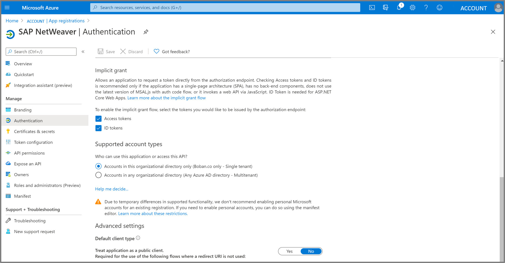

# Azure Active Directory Configuration

In this part we will configure Azure Active Directory (AAD) to be the working Identity Provider (IDP) for our frontend Azure Client Application (AngluarFE), API Application and SAP NetWeaver.

|Topic|Description|
|:-----------|:------------------|
|[Register Application (Client App)](#register-application-client-app)|Registering the frontend application (AngularFE)|
|[Register Application (API App)](#register-application-api-app)|Registering the API application|
|[Register Enterprise Application (Backend: SAP NetWeaver)](#register-enterprise-application-backend-sap-netweaver)|Registering the backend application|
|[Register Enterprise Application (Backend: SAP Cloud Platform)](#register-enterprise-application-backend-sap-netweaver)|Registering the backend application|

### Introduction 

> The following steps register the three applications in AAD:
> 1. The first app registration for the frontend web app enables a frontend for the user to authenticate on. 
> 2. The second app registration for the API app delegates the authentication of the user between AAD and SAP. It needs to be configured to authenticate user (Jane Doe, jdoe@contoso.com) and get an **access token** (issued by AAD) with the OAuth2 Implicit Flow.
> 3. The enterprise app registration represents SAP Netweaver with the backend service and is required to support <br> the On-behalf-of flow to request the SAML assertion. This app will be registered as an enterprise application from the AAD Gallery. This enables the exchange of an **AAD access token** with a **SAML 2.0 Assertion** (issued by AAD) <br> using the Oauth On Behalf Of Flow (Bearer SAML Assertion Flow)​.

## Register Application (Client App)

1. Go to portal.azure.com
2. Navigate to **Azure Active Directory** via the menu or the global search
3. Select **App registrations** in the left bar
4. Create a New registration
5. Insert a **name** e.g. *Frontend* and leave all the settings as **default**
6. Select **Register**
7. Save the application (client) ID to a notepad. As we will have a bunch of ids in the Postman scenario, try to label each while saving it to the notepad.


### Configure the authentication settings of the Client Application
1. As next step we need to configure the authentication of the client app. Hit the **Authentication** button on the left bar. 
2. Click **Add a platform**
3. Choose the **Single-page application**
4. Then insert the redirect uri as shown in the image below. <br> 
```https://localhost:5001``` <br>
The URI is used as destination when returning authentication responses (tokens) after successfully authenticating users.
5. In addition to this please check the boxes of **Access tokens** and **ID tokens**.
6. Check **Accounts in any organizational directory (Any Azure AD directory - Multitenant)**.
7. After all these changes hit *Save*. 


### Add a Client Secret for the Client Application
Credentials enable confidential applications to identify themselves to the authentication service when receiving tokens at a web addressable location (using an HTTPS scheme). 
A secret is a string that the application uses to prove its identity when requesting a token. 
1. So as next step please select the button **Certificates & secrets**. 
2. Add a **New client secret**.
3. Copy the value of the client secret into a notepad.


### Expose an API of the Client Application
1. Now we need to expose our API by defining the scope for the implicit grand flow. Navigate to **Expose an API**.
2. Define custom scopes to restrict access to data and functionality protected by the API. An application that requires access to parts of this API can request that a **user or admin has to consent** to one or more of these scopes. Check **Admins and Users**. For example you can insert as scope: <br> ```api://<CLIENT_APP_ID>/read```. <br>
You are free to enter more descriptive names and descriptions.
4. After the changes hit **Save**. 


### Download the Federation metadata document
1. We are now going to download the federation metadata document as we are going to need it later on in the SAP configuration. <br> Navigate to **Overview** of your Angular FE/Client Application registered in the AAD.
2. Select **Endpoints**.
3. Copy the **federation metadata document url** and save it to the notepad.


## Register Application (API App)

For the implicit grant flow you need to get an access token from the Azure Active Directory using an API application.
1. Navigate to **Azure Active Directory** via the menu or the global search
2. Select **App registrations** in the left bar
3. Create a **New registration**
4. Insert a **name** e.g. *Frontend* and leave all the settings as **default**
5. Select **Register**
6. Save the application (client) ID to a notepad


### Configure the authentication settings of the API Application
1. As next step we need to configure the authentication of the API app. Hit the **Authentication** button on the left bar.
2. **Add the plattform** and choose the **Web** Template
3. Check the boxes of **Access tokens** and **ID tokens**.
4. Select **Accounts in this organizational directory only (<ACCOUNT> only - Single tenant)**
5. After all these changes hit **Save**. 




### Add a Client Secret for the Client Application
1. Select the button **Certificates & secrets**. 
2. Add a **New client secret**.
3. Copy the value of the client secret to a notepad.

### Expose an API of the API Application
1. Now we need to expose our API by defining the scope for the implicit grand flow. Navigate to **Expose an API**.
2. Accept the **default** value in the **Application ID Uri**
3. **Add a scope** that looks like this: <br> ```api://<API-APP-ID>/impersonate```.  And check the box **Admins and Users**. <br> 
3. **Add a client application** and enter the **Client Applications ID** saved to the notepad in the last section. Check the box **Authorized scopes**.
4. After the changes hit **Save**. 




## Register Enterprise Application (Backend: SAP NetWeaver)

To get access to the SAP ODATA Services seamlessly we configure the Azure Active Directory using a SAP NetWeaver as enterprise application.
This is important due to the goal and ability of enabling Single Sign On. <br>
<br>

Please proceed with the following steps:

1. Navigate to **Enterprise applications** under **Azure Active Directory**
2. Create a **New application**
3. Search for **SAP NetWeaver** and **Add** the selected application.
4. Save the Application (client) ID to a notepad.


### Configure Single Sign-On (Basic SAML Configuration) of the SAP Application
1. Select **Single sign-on** in the left bar. 
2. Select **SAML** Tile 
3. Click on the **Edit** Button of the **Basic SAML Configuration** Tab. 
4. Please insert an **Entity ID** should be equal to the **Provider-Name** of your SAP Netweaver 
5. Please insert the following Reply URL: <br> ```https://<SAP-IP-ADDRESS>:44300/sap/bc/sec/oauth2/token``` and ```https://<SAP-IP-ADDRESS>:44300/sap/saml2/sp/asc/100```
6. Please insert the following Sign on URL ```https://<SAP-IP-ADDRESS>:44300/sap/bc/ui5_ui5/ui2/ushell/shells/abap/FioriLaunchpad.html```
7. After all these changes hit **Save**. 

> We used as SSL Port **44300** if you have a different Port in your scenario, just adapt the URL.
> For the **Entity ID** you should choose the **Provider-Name** of your SAP Netweaver 


### Configure Single Sign-On (User Attributes & Claims) of the SAP Application
1. Select the **Edit** button of the **User Attributes & Claims** section.
2. Select the **Unique User Identifier** from the list by clicking on the entry
3. Choose the name identifier format **Email address**, select **Attribute** and insert **user.userprincipalname** as source attribute. 
4. After all these changes hit **Save**. 

> We assume that the **Name ID** in the SAP Netweaver is an **email address** and that it is equal to the **user.userprincipalname**. <br>


> If in your scenario the **userprincipalname** differs from the **email address**, choose the correct value for your scenario e.g. **user.mail**


### Configure Single Sign-On (SAML Signing Certificate) of the SAP Application
1. Click on the **Edit** Button of the **SAML Signing Certificate** section. 
2. Import a signing Certificate. Choose as the **Signing Option** the **Sign SAML assertion** and as the **Signing Algorithm** choose **SHA-256**. 
3. After all these changes hit **Save**.  


<br>

### Single Sign-On configuration of the SAP Application

The final **Single Sign-On** setup should look like this:
<br>
<br>


### Configure the authentication settings of the SAP Application

1. As next step we need to configure the authentication of the SAPNetweaver app. Go back to the Azure AD overview and switch to the general **App registrations** on the left bar and select **All applications**. Now you should find the SAP NetWeaver App. Select it. 
2. Navigate to **Authentication** in the left bar. If not already shown: **Add a platform** and select **Web**.
3. Add the following Redirect URIs: <br> ```https://<SAP-IP-ADDRESS>:44300/sap/saml2/sp/asc/100``` and ```https://<SAP-IP-ADDRESS>:44300/sap/bc/sec/oauth2/token``` 


4. Check the boxes of **Access tokens** and **ID tokens**.
5. After all these changes hit **Save**.



### Expose an API of the SAP Application

Now we need to expose our API by defining the scope and the application id uri in the implicit grand flow. 
1. Edit the Application ID URI to this: <br> ```https://<SAP-IP-ADDRESS>:44300/sap/bc/sec/oauth2/token```
2. **Add a scope** that looks as follows: <br> ```https://<SAP-IP-ADDRESS>:44300/sap/bc/sec/oauth2/token/user_impersonation```
3. Set the authorized client applications by pressing **Add a client application** and adding the  **Application (client) ID** from the **API application** registered earlier and *check the box* **Authorized scopes**.  
4. After all these changes hit **Add Application**. 


## Next Steps

Now let's jump into the section for [configuring SAP](../SAPNetWeaverConfiguration/README.md).

## Additional resources

- [ List of Tutorials on How to Integrate SaaS Apps with Azure Active Directory ](https://docs.microsoft.com/azure/active-directory/active-directory-saas-tutorial-list)

- [What is application access and single sign-on with Azure Active Directory? ](https://docs.microsoft.com/azure/active-directory/active-directory-appssoaccess-whatis)

- [What is conditional access in Azure Active Directory?](https://docs.microsoft.com/azure/active-directory/conditional-access/overview)

- [Try Visibly with Azure AD](https://aad.portal.azure.com/)

- [What is session control in Microsoft Cloud App Security?](https://docs.microsoft.com/cloud-app-security/proxy-intro-aad)
- https://blogs.sap.com/2020/07/17/principal-propagation-in-a-multi-cloud-solution-between-microsoft-azure-and-sap-cloud-platform-scp/