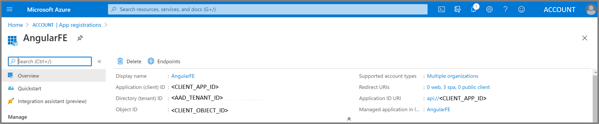

# Azure Active Directory Configuration

In this part you will configure Azure Active Directory (AAD) to be the working Identity Provider (IDP) for our Azure Application and SAP.

|Topic|Description|
|:-----------|:------------------|
|[Register Application (Client App)](#register-application-client-app)|Registering the frontend application|
|[Register Enterprise Application (Backend: SAP NetWeaver)](#register-enterprise-application-backend-sap-netweaver)|Registering the backend application|
|[Configure registered Applications in Azure Active Directory](#configure-registered-applications-in-azure-active-directory)|Configuring the Single Sign On within the registered applications|

> **Introduction** <br>
> The following steps register the two applications in AAD:
> 1. The first app registration for the frontend web app enables authentication for the user in AAD
> 2. The second app registration represents SAP Netweaver with the backend service and is required to support the On-behalf-of flow to request the SAML assertion. This app will be registered as an enterprise application from the AAD Gallery

> The following steps need an access token and a SAML assertion issued by the AAD:
> 1. Authenticate user (Jane Doe, jdoe@contoso.com) and get an *access token (**issued by AAD**)* <br> with the OAuth2 Implicit Flow​
> 2. Exchange the *AAD access token* with a *SAML 2.0 Assertion (**issued by AAD**)* <br> with the Oauth On Behalf Of Flow (Bearer SAML Assertion Flow)​
> 
## Register Application (Client App)

For the implicit grant flow we need to get an access token from the Azure Active Directory using a client application.



> **Configure an Authentication of the Application**
> 1. As next step we need to configure the authentication of the client app. Hit the *Authentication* button on the left bar. 
> 2. Then insert the redirect uris. The URIs are used as destinations when returning authentication responses (tokens) after successfully authenticating users.
> 3. In addition to this please check the boxes of *Access tokens* and *ID tokens*.
> 4. After all these changes hit *Save*. 


> **Add a Client Secret for the Application**
> 1. Credentials enable confidential applications to identify themselves to the authentication service when receiving tokens at a web addressable location (using an HTTPS scheme). 
> 2. A secret string that the application uses to prove its identity when requesting a token. 
> 3. So as next step please select the button certificates & secrets and add a new *New client secret*.
> 4. Don't forget to copy the value of the client secret into an local notepad.


> **Expose an API of the Application**
> 1. Now we need to expose our API by defining the scope and the application id uri in the implicit grand flow. 
> 2. Define custom scopes to restrict access to data and functionality protected by the API. 
> 3. An application that requires access to parts of this API can request that a user or admin consent to one or more of these. For example you can insert as scope <br> ```api://<CLIENTAPP-ID>/read```. 
> 4. After all these changes hit *Save*. 


## Register Enterprise Application (Backend: SAP NetWeaver)

> For the on behalf of flow we need to get an SAML assertion from the Azure Active Directory using a SAP NetWeaver as enterprise application.


> **Configure an Single Sign-On of the SAP Application**
> 1. Please select *Single sign-on* on the left bar. 
> 2. You can see the following Overview of *Basic SAML Configuration*, *User Attributes & Claims* and *SAML Signing Certificate*.


> 3. Furthermore in the overview you can see the *SAML Signing Certificate* and the *Set up SAP NetWeaver*. 
> 4. In the following steps we will configure this enterprise application as shown in the screenshots.


> **Configure an Single Sign-On (Basic SAML Configuration) of the SAP Application**
> 1. Click on the *Edit* Button of the *Basic SAML Configuration* Tab. Please insert the following Reply URL: <br> ```https://<SAP-IP-ADDRESS>:44300/sap/bc/sec/oauth2/toke``` and ```https://<SAP-IP-ADDRESS>:44300/sap/saml2/sp/asc/100```.
> 2. After all these changes hit *Save*. 


> **Configure an Single Sign-On (User Attributes & Claims) of the SAP Application**
> 1. Then Click on the *Edit* Button of the *User Attributes & Claims* Tab.
> 2. Choose name identifier format *Email address*, select *Attribute* and insert as Source Attribute *user.userprincipalname*. 
> 3. After all these changes hit *Save*. 


> **Configure an Single Sign-On (SAML Signing Certificate) of the SAP Application**
> 1. Then Click on the *Edit* Button of the *SAML Signing Certificate* Tab. 
> 2. Import a signing Certificate. Choose as the *Signing Option* the *Sign SAML assertion* and as the *Signing Algorithm* choose *SHA-256*. 
> 3. After all these changes hit *Save*.  


## Configure registered Applications in Azure Active Directory

> 1. As next step we need to configure the authentication of the SAPNetweaver app. 
> 2. Switch to the general *App Registrations* on the left bar and select under *all Applications* the SAP NetWeaver App. 
> 3. Hit the *Authentication* button on the left bar. Then insert the recirect uris. 
> 4. The URIs are used as destinations when returning authentication responses (tokens) after successfully authenticating users. 
> 5. Insert the following reply urls: <br> ```https://<SAP-IP-ADDRESS>:44300/sap/saml2/sp/asc/100``` and ```https://<SAP-IP-ADDRESS>:44300/sap/bc/sec/oauth2/token``` 
> 6. After all these changes hit *Save*. 


> 7. We stay on the *Authentication* tab.
> 8. In addition to this please check the boxes of *Access tokens* and *ID tokens* and after all these changes hit *Save*.


> 1. Now we need to expose our API by defining the scope and the application id uri in the implicit grand flow. 
> 2. Define custom scopes to restrict access to data and functionality protected by the API. 
> 3. An application that requires access to parts of this API can request that a user or admin consent to one or more of these. For example you can insert as scope <br> ```https://<SAP-IP-ADDRESS>:44300/sap/bc/sec/oauth2/token```
> 4. Important is to add a client application by adding the *CLIENT ID* from the frontend client application registered earlier and to check the box *Authorized scopes*.  
> 5. After all these changes hit *Save*. 


## Next Steps

Now let's test the scenario and jump into the section for setting up [Postman](../PostmanSetup/README.md)