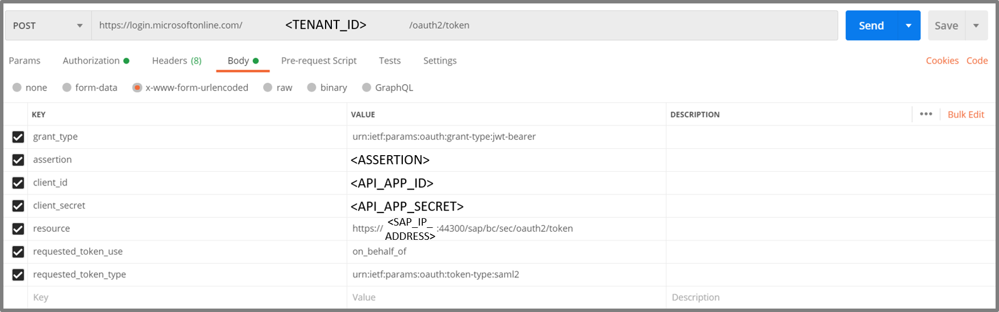

# Postman Setup

## Prerequisites

This setup requires the configurations made in [Azure AD Configuration](../AzureActiveDirectoryConfiguration/README.md) and, depending on the option you chose for this tutorial, either the configuration in [SAP NetWeaver](../SAPNetWeaverConfiguration/README.md) or [SAP Cloud Platform](../SAPCloudPlatformConfiguration/README.md). If you haven't already, go back to those steps as you will get errors if the environments are not set up right.
We are going to use Postman to send HTTP(S) GET- and POST-Requests. You can download it [here](https://www.postman.com/downloads/) and use [Postman Learning](https://learning.postman.com/getting-started/) to familiarize yourself with the tool.
Under [Postman_SAP_OAuth_SAML_flow.json]() you will find the importable JSON file containing the four requests. You can either adapt these or build them yourself.

## Test procedure

1. Authenticate the user (e.g. Jane Doe, jdoe@contoso.com) and get an **access token** (issued by Azure AD) with the OAuth2 Implicit Flow​
1. Exchange the **Azure AD access token** with a **SAML 2.0 Assertion** (issued by Azure AD) with the OAuth OBO flow. The token will be redirected from the client app to the API app.
1. The API acquires an **OAuth access token** (issued by OAuth Authorization Server of SAP) for accessing the SAP NetWeaver OData service or SAP Cloud Platform Web service by exchanging the SAML Assertion using the OAuth 2.0 SAML Bearer Assertion Flow.​
1. Send a GET to the SAP service endpoint with the acquired **OAuth access token** (issued by OAuth Authorization Server of SAP) in the HTTP Authorization Header​

## Implicit Grant Flow

### **GET** Request to receive access token from Azure Active Directory

- For single-page applications the Microsoft identity platform supports the OAuth 2.0 Implicit Grant flow. This flow is described in the [OAuth 2.0 Specification](https://tools.ietf.org/html/rfc6749#section-4.2).
- Its primary benefit is that it allows the app to get tokens from Microsoft identity platform without performing a backend server credential exchange.
- This allows the app to sign in the user, maintain session, and get tokens to other web APIs all within the client JavaScript code.
- For now you are going to fetch the access/bearer token for the frontend application using a GET Request.

To do so, create a **GET Request**. Copy this URL into a **GET** Request in **Postman**. **Insert the blanks** (see the description in the table below). The URL should look something like this:

```http
https://login.microsoftonline.com/<DIRECTORY_ID>/oauth2/v2.0/authorize?client_id=<CLIENT_ID>&response_type=token&redirect_uri=https://localhost:5001&scope=api://<CLIENT_ID>/read&response_mode=fragment&state=12345&nonce=678910
```

Fill the **Params** of the GET request as shown in the image and/or the table further down.


**GET** Request to receive access token from Azure Active Directory (Implicit Grant Flow)

1. For the **Client ID** use the **frontend application client id**.
1. For the **scope** use the **scope from the API app**.

Copy & paste the URL from Postman into a new Web browser tab and hit return. After successful authentication to your Azure AD tenant with the test user (e.g. jdoe@contoso.com), you will receive an **access token**, starting with ```ey...```.
> [!NOTE] If the URL you are redirected to (in this case **https://localhost:5001/**) is not displaying a real website, that is still correct. Be sure to copy the entire access token following the URL fragment ```#access_token=``` which is delimited by the parameter ```&token_type**``´. Be aware that the access token will expire. You can see that in the response being **expires_in**.


The parameters should look like this:

|PARAMETER|VALUE|DESCRIPTION|
|:-----------|:------------------|:---------------------------|
|client_id|**Client Application (client) ID**|The **Client Application (client) ID** that the Azure portal - App registrations page assigned to your app.|
|response_type|**token**|Using token here will allow your app to receive an access token immediately from the authorize endpoint without having to make a second request to the authorize endpoint. The scope parameter must contain a scope indicating which resource to issue the token for.|
|redirect_uri|**https://localhost:5001**|The redirect_uri of your app, where authentication responses can be sent and received by your app. It must exactly match one of the redirect_uris you registered in the portal, except it must be url encoded.|
|scope|e.g. ```api://**API Application (client) ID**/impersonate``` - use yours from the notepad|A space-separated list of scopes. As set up in Azure AD previously.|
|response_mode|**fragment**|Specifies the method that should be used to send the resulting token back to your app. Is set as fragment if the token response includes an id_token.|
|state|**12345**|A value included in the request that will also be returned in the token response.|
|nonce|**678910**|A value included in the request, generated by the app, that will be included in the resulting id_token as a claim.|

## On Behalf Of Flow

### **POST** Request to receive SAML Assertion from Azure AD

The OAuth 2.0 On-Behalf-Of flow (OBO) serves the use case where an application invokes a service/web API, which in turn needs to call another service/web API. The idea is to propagate the delegated user identity and permissions through the request chain. For the middle-tier service to make authenticated requests to the downstream service, it needs to secure an access token from the Microsoft identity platform, on behalf of the user.
The user now has been authenticated using the Implicit Grant Flow. You got an OAuth access token from Azure AD for the frontend application and are now exchanging it for a SAML assertion to obtain a new OAuth access token from SAP to call the backend service.
To receive a SAML Bearer Assertion from Azure AD, you need to send the **access token** from the previous GET Request along with other parameters in the following step.

1. Create a **POST** request which should look like this:
    ```http
    https://login.microsoftonline.com/TENANT_ID/oauth2/token
    ```
1. Fill the **Body** section of the POST request as shown in the image and/or the table further down.
    
1. **Send** the POST request. In the **Response** you will find another **access_token** starting with **PEF...**. Save this token to the notepad.

Fill in the following key value pairs into the **Body** section of the **Postman** request:

|PARAMETER|VALUE|DESCRIPTION|
|:-----------|:------------------|:---------------------------|
|grant_type|**urn:ietf:params:oauth:grant-type:jwt-bearer**|The type of token request. For a request using a JSON Web Token (JWT), the value must be urn:ietf:params:oauth:grant-type:jwt-bearer.|
|assertion|**<OAuth access token>** e.g. ```ey...```|The value of the token used in the request. This token must have an audience of the app making this OBO request (the app denoted by the client-id field). In this case the access token we got from the previous request using the implicit grant flow.|
|client_id|**API application (client) ID**|The API application (client) ID which we will receive in the overview section of the registered API application in Azure AD.|
|client_secret|**API application secret**|The API application secret generated for the API application in Azure portal - App registrations page.|
|resource|https://*SAP_IP_ADDRESS*:44300/sap/bc/sec/oauth2/token (SAP NetWeaver, option 1), or https://*subaccount*.authentication.*landscape*.hana.ondemand.com (SAP Cloud Platform, option 2), e.g. `https://98abcd76trial.authentication.us10.hana.ondemand.com`|A space separated list of scopes for the token request. As set up within Azure AD and SAP.|
|requested_token_use|**on_behalf_of**|Specifies how the request should be processed. In the OBO flow, the value must be set to `on_behalf_of`.|
|requested_token_type|**urn:ietf:params:oauth:token-type:saml2**|An identifier, for the type of the requested security token. For example, a SAML2 Assertion can be requested with the identifier "urn:ietf:params:oauth:token-type:saml2".|

## SAML Bearer Assertion

**Introduction to SAML assertions**

- The SAML assertion (as discussed [here](../README.md)) needs the correct `Audience` which is associated with its `Condition` element. It defines under which security conditions the assertion is valid, such as the earliest and latest time at which it is valid, who can consume the assertion, etc. The `Audience` element value must match the SAML service provider (SP) name or `EntityID` of your SAP NetWeaver Application Server or SCP account.
- The `Subject` element in the assertion uniquely identifies the user who must be known to the IDP (Azure AD) and the SAP backend. It also has a value for the `Recipient` to define for whom the assertion has been issued, along with the format of the user identifier (Name ID format, e.g. e-mail address).

> [!NOTE] For option 1 in this tutorial, a dialog user must be created in the SAP NetWeaver Application Server, and the correct Name ID format must be configured in the federation settings.

- To ensure the integrity of the SAML assertion, a valid signature of a trusted IDP is necessary. The IDP (Azure AD) signs the SAML assertion to proof to the recipient, the OAuth Authorization Server in SAP NetWeaver or SCP, that only Azure AD could have issued the assertion. Thus, the trust between SAP and Azure AD must be configured.
- The frontend app requests the SAML assertion for the enterprise application registered in Azure AD, which represents the SAP NetWeaver system or SCP account. This app is created from the Azure AD SaaS app gallery of type *SAP NetWeaver* or *SAP Cloud Platform*, which allows to configure SSO settings for SAML. Those settings are taken by Azure AD when it generates the SAML assertion in response to an OBO request. Details of the app registration and configuration were discussed in the following section: [Azure Active Directory Configuration](../AzureActiveDirectoryConfiguration/README.md)
- In Order to access SAP an OAuth Client and the necessary authorized scopes should be configured as discussed below.

## Option 1: SAP NetWeaver

### **POST** Request to exchange the SAML Assertion for the access token from OAuth Authorization Server of SAP NetWeaver

1. Create a new **POST** Request in Postman. It should look like this:
```https://<SAPNETWEAVER_IP_ADDRESS>:44300/sap/bc/sec/oauth2/token```
1. Under **Authorization** enter the **client_id** with its **secret/password**.
  
1. Fill the **Body** as shown in the image and/or the table further down.
  
1. Send the POST request and save the received **access token** to the notepad.

The Body should look like this:

|KEY|VALUE|DESCRIPTION|
|:-----------|:------------------|:---------------------------|
|client_id|**<SAP Client name>** e.g. ```CLIENT1```|During the SAP Set-Up a client was created. It should be named Client1 or Client_1. Enter this name here.|
|grant_type|**urn:ietf:params:oauth:grant-type:saml2-bearer**|Define the grant type to be SAML 2.0 Bearer assertion. This was also set up earlier in Azure AD.|
|assertion|**<SAML 2.0 Assertion>** e.g. ```PEF...```|The SAML 2.0 assertion from the previous request will have the correct audience and recipient to exchange the assertion with an access token.|
|scope|**<SAP ODATA scope>** e.g. ```ZGWSAMPLE_BASIC_0001```|To receive the right access token to the scope created in SAP, list it here.|

The Open Data Protocol (OData) is a data access protocol built on core protocols like HTTP and commonly accepted methodologies like REST for the web. There are various kinds of libraries and tools can be used to consume OData services. But for beginners and those who want to write their own libraries, the pure HTTP requests and responses are also very important. This documentation will not cover every feature details for OData V4 services but will try to cover various typical scenarios. If you want to have a more detailed understanding, please refer to OData Documentation.

### **GET** Request using Bearer access token to receive the product data from SAP

Now we will perform a **GET** Request using an access token to receive the product data from SAP

- Here we insert the **access token** from the previous REST Call (POST).
- And we should receive *access to the data* as result.

The process will be performed as follows:

1. Create a new **GET** Request in Postman. It should look like this:

    ```http
    https://<SAPNETWEAVER_IP_ADDRESS>:44300/sap/opu/odata/iwbep/GWSAMPLE_BASIC/ProductSet
    ```

    

1. Fill the **Header** as shown in the image and/or the table further down.
  
1. Send the GET request. The Result should look like this:
  

## Option 2: SAP Cloud Platform

### **POST** Request to exchange the SAML Assertion for the access token from OAuth Authorization Server of SCP (XSUAA)

1. Create a new **POST** Request in Postman to the XSUAA token endpoint of your SCP account. It follows this pattern for an SCP trial account:

    ```http
    https://<subdomain>.authentication.<landscape>.hana.ondemand.com/oauth/token/alias/<subdomain>.aws-live
    ```

    For example, the XSUAA token endpoint URL for SCP trial account `98abcd76trial` on the `us10` SCP landscape is `https://98abcd76trial.authentication.us10.hana.ondemand.com/oauth/token/alias/98abcd76trial.aws-live`
    
1. Fill the **Body** parameters as follows:
    |KEY|VALUE|DESCRIPTION|
    |:-----------|:------------------|:---------------------------|
    |grant_type|**urn:ietf:params:oauth:grant-type:saml2-bearer**|Define the grant type to be SAML 2.0 Bearer assertion.|
    |assertion|**<SAML 2.0 Assertion>** e.g. ```PEF...```|The SAML 2.0 assertion from the previous request will have the correct audience and recipient to exchange the assertion with an access token.|
1. Under **Authorization** enter the `clientid` and `secret` obtained from the [SCP setup](../SAPCloudPlatformConfiguration/README.md##export-of-SCP-SAML-metadata-and-OAuth-client-credentials)
1. Send the POST request and save the received **access token** to the notepad.


## Web service call to SCP

This request calls the backend service in SCP and requires the access token from the previous response. Select the Authorization tab and paste the access_token value into the Access Token field.

1. Create a new **GET** request in Postman to the Web service endpoint. It should look like this:

```http
https://service-<subdomain>.cfapps.<domain>/hello
```

For example, the service endpoint in a trial account with subdomain `98abcd76trial` on the `us10` SCP landscape is `https://service-98abcd76trial.cfapps.us10.hana.ondemand.com/hello`

1. Select the **Authorization** tab and paste the `access_token` value from the previous response into the *Access Token* field.
1. Click *Send*.

The response from SCP shows the propagated principal’s name identifier and the additional user attributes which were successfully federated. The principal also obtained the required scopes (“Display”) in SCP to call the backend service based on the Role Collection assignment.

The Header should look like this:

|KEY|VALUE|DESCRIPTION|
|:-----------|:------------------|:---------------------------|
|Authorization|Bearer **<access token>** (from earlier POST) |Bearer access token is a security token that grants the **“bearer”** access to a protected resource. As this token is received by the authorization server of SAP, it grants access to the SAP Data.|

## Done and Cleanup resources

Don't forget to delete all resources if you do not need them anymore.

### Azure Portal

1. Navigate to the Azure Active Directory in the Azure Portal and select the Registered Applications. Select the button to show all applications.
2. Delete the SAPNetWeaver Application, the Client Application (AngularFE) and the API Application.

### PowerShell

```powershell
Remove-AzAdApplication -ApplicationId $api.AppId -Force
Remove-AzAdApplication -ApplicationId $app.AppId -Force
Remove-AzAdApplication -ApplicationId $sap.AppId -Force
```

## Additional resources

- [List of Tutorials on How to Integrate SaaS Apps with Azure Active Directory ](https://docs.microsoft.com/azure/active-directory/active-directory-saas-tutorial-list)

- [What is application access and single sign-on with Azure Active Directory? ](https://docs.microsoft.com/azure/active-directory/active-directory-appssoaccess-whatis)

- [What is conditional access in Azure Active Directory?](https://docs.microsoft.com/azure/active-directory/conditional-access/overview)

- [Try Visibly with Azure AD](https://aad.portal.azure.com/)

- [What is session control in Microsoft Cloud App Security?](https://docs.microsoft.com/cloud-app-security/proxy-intro-aad)
- https://blogs.sap.com/2020/07/17/principal-propagation-in-a-multi-cloud-solution-between-microsoft-azure-and-sap-cloud-platform-scp/