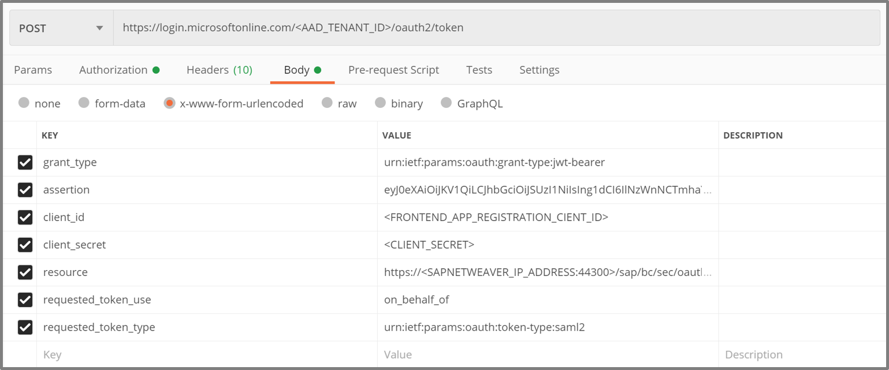

# Postman SetUp

|Topic|Description|
|:-----------|:------------------|
|[**GET** Request to receive access token from Azure Active Directory <br>(Implicit Grant Flow)]()|What needs to be done|
|[**POST** Request to receive SAML Assertion from Azure Active Directory <br> (On Behalf Flow)]()|What needs to be done|
|[**POST** Request using SAML Assertion to receive access token from SAP <br>(SAML Bearer Assertion Flow)]()|What needs to be done|
|[**GET** Request using access token to receive the product data from SAP <br> to view in application]()|What needs to be done|

## Prerequisites

This SetUp requires the configurations made in [SAP Configuration](././SAPConfiguration/README.md) and [AAD Configuration](././AzureActiveDirectoryConfiguration/README.md). If you haven't already, go back to those steps as you will get errors if the environments are not set up right.

We are going to use Postman to send our GET- and Post-Requests, please download it [here](https://www.postman.com/downloads/) and use [Postman Learning](https://learning.postman.com/getting-started/) to familiarize yourself with the tool.

Under [Postman_SAP_Oauth_SAML_flow.json]() you will find the importable json file containing the four requests. You can either adapt these or build them yourself.

## Implicit Grant Flow

### **GET** Request to receive access token from Azure Active Directory 

For single-page applications the Microsoft identity platform supports the OAuth 2.0 Implicit Grant flow. This flow is described in the [OAuth 2.0 Specification](https://tools.ietf.org/html/rfc6749#section-4.2). Its primary benefit is that it allows the app to get tokens from Microsoft identity platform without performing a backend server credential exchange. This allows the app to sign in the user, maintain session, and get tokens to other web APIs all within the client JavaScript code.

For now we are going to fetch the access/bearer token to our client application using a GET Request.

To do so, create a GET Request. In the end the URL should look something like this: ´

```https://login.microsoftonline.com/DIRECTORY_ID/oauth2/v2.0/authorize?client_id=CLIENT_ID&response_type=token&redirect_uri=https://localhost:5001/api/tokenechofragment&scope=https://SAML_AAD_CONFIG2/user_impersonation&response_mode=fragment&state=12345&nonce=678910```


The Params should look like this:

|KEY|VALUE|DESCRIPTION|
|:-----------|:------------------|:---------------------------|
|client_id|Application (client) ID|The Application (client) ID that the Azure portal - App registrations page assigned to your app.|
|response_type|token|It may include the response_type token. Using token here will allow your app to receive an access token immediately from the authorize endpoint without having to make a second request to the authorize endpoint. If you use the token response_type, the scope parameter must contain a scope indicating which resource to issue the token for (for example, user.read on Microsoft Graph).|
|redirect_uri|https://localhost:5001/api/tokenechofragment|The redirect_uri of your app, where authentication responses can be sent and received by your app. It must exactly match one of the redirect_uris you registered in the portal, except it must be url encoded.|
|scope|https://SAML_AAD_CONFIG2/user_impersonation|A space-separated list of scopes. For OpenID Connect (id_tokens), it must include the scope openid, which translates to the "Sign you in" permission in the consent UI. Optionally you may also want to include the email and profile scopes for gaining access to additional user data. You may also include other scopes in this request for requesting consent to various resources, if an access token is requested. API Permissions on Client App?|
|response_mode|fragment|Specifies the method that should be used to send the resulting token back to your app. Defaults to query for just an access token, but fragment if the request includes an id_token.|
|state|12345|A value included in the request that will also be returned in the token response. It can be a string of any content that you wish. A randomly generated unique value is typically used for preventing cross-site request forgery attacks. The state is also used to encode information about the user's state in the app before the authentication request occurred, such as the page or view they were on.|
|nonce|678910|A value included in the request, generated by the app, that will be included in the resulting id_token as a claim. The app can then verify this value to mitigate token replay attacks. The value is typically a randomized, unique string that can be used to identify the origin of the request. Only required when an id_token is requested.|


## On Behalf Of Flow

### **POST** Request to receive SAML Assertion from Azure Active Directory

The OAuth 2.0 On-Behalf-Of flow (OBO) serves the use case where an application invokes a service/web API, which in turn needs to call another service/web API. The idea is to propagate the delegated user identity and permissions through the request chain. For the middle-tier service to make authenticated requests to the downstream service, it needs to secure an access token from the Microsoft identity platform, on behalf of the user.

The user now has been authenticated using the Implicit Grant Flow. We got an access token for the Client application and are now exchanging it against an SAML assertion for the SAP application.

Create a POST request which should look something like this: 
```https://login.microsoftonline.com/TENANT_ID/oauth2/token```




|KEY|VALUE|DESCRIPTION|
|:-----------|:------------------|:---------------------------|
|grant_type|urn:ietf:params:oauth:grant-type:jwt-bearer|The type of token request. For a request using a JWT, the value must be urn:ietf:params:oauth:grant-type:jwt-bearer.|
|assertion|jwt token|The value of the token used in the request. This token must have an audience of the app making this OBO request (the app denoted by the client-id field). In this case the access/bearer token we got from the Implicit Grant Flow.|
|client_id|application (client) ID|The application (client) ID that the Azure portal - App registrations page has assigned to your app. I am assuming the SAP App.|
|client_secret||The client secret that you generated for your app in the Azure portal - App registrations page.|
|resource|https://SAML_AAD_CONFIG2|A space separated list of scopes for the token request. For more information, see scopes. - Scope = Resource in Oauth1|
|requested_token_use|on_behalf_of|Specifies how the request should be processed. In the OBO flow, the value must be set to on_behalf_of.|
|requested_token_type|urn:ietf:params:oauth:token-type:saml2|An identifier, as described in Token Type Identifiers (OAuth 2.0 Token Exchange Section 3), for the type of the requested security token.<br>For example, a JWT can be requested with the identifier "urn:ietf:params:oauth:token-type:jwt".<br>If the requested type is unspecified, the issued token type is at the discretion of the Authorization Server and may be dictated by knowledge of the requirements of the service or resource indicated by the "resource" or "audience" parameter.|

## ODATA REST Call

### **GET** Request using access token to receive the product data from SAP


## Postman SetUp

|Topic|Description|
|:-----------|:------------------|
|[**GET** Request to receive access token from Azure Active Directory <br>(Implicit Grant Flow)]()|What needs to be done|
|[**POST** Request to receive SAML Assertion from Azure Active Directory <br> (On Behalf Flow)]()|What needs to be done|
|[**POST** Request using SAML Assertion to receive access token from SAP <br>(SAML Bearer Assertion Flow)]()|What needs to be done|
|[**GET** Request using access token to receive the product data from SAP <br> to view in application]()|What needs to be done|
