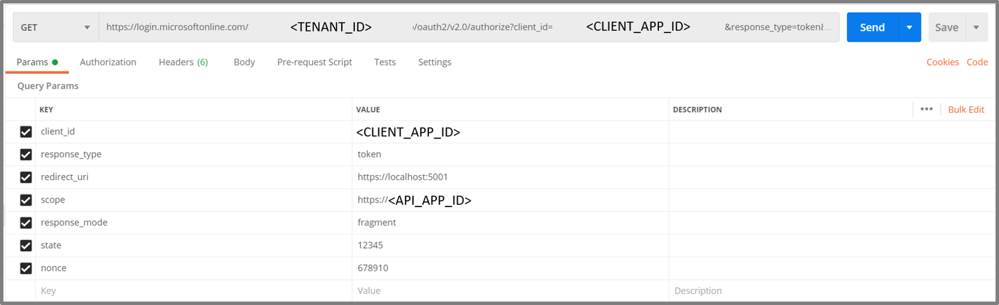
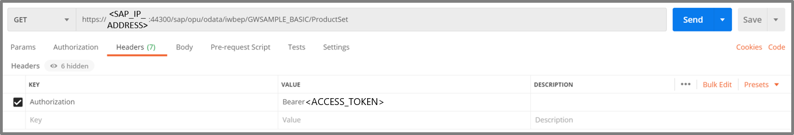

# Postman SetUp

We will set up Postman to receive all necessary tokens to send an ODATA Request against our SAP NetWeaver.

|Topic|Description|
|:-----------|:------------------|
|[**GET** Request to receive access token from Azure Active Directory](#get-request-to-receive-access-token-from-azure-active-directory)|Usage of Implicit Grant Flow|
|[**POST** Request to receive SAML Assertion from Azure Active Directory](#post-request-to-receive-saml-assertion-from-azure-active-directory)|Usage of On Behalf Flow|
|[**POST** Request using SAML Assertion to receive access token from SAP](#post-request-to-exchange-the-saml-assertion-for-the-access-token-from-oauth-authorization-server-of-sap)|Receiving SAML Bearer Assertion Flow from the OAuth Authorization Server of SAP|
|[**GET** Request using access token to receive the product data from SAP to view in application](#get-request-using-access-token-to-receive-the-product-data-from-sap)|REST Call to receive Data from SAP|

## Prerequisites

This SetUp requires the configurations made in [AAD Configuration](././AzureActiveDirectoryConfiguration/README.md) and [SAP Configuration](././SAPConfiguration/README.md). <br> 
> If you haven't already, go back to those steps as you will get errors if the environments are not set up right. <br>
> We are going to use Postman to send our GET- and POST-Requests, please download it [here](https://www.postman.com/downloads/) and use [Postman Learning](https://learning.postman.com/getting-started/) to familiarize yourself with the tool. <br>
> Under [Postman_SAP_Oauth_SAML_flow.json]() you will find the importable json file containing the four requests. You can either adapt these or build them yourself.

## Process

**Scenario: Frontend Application communicates via API to SAP NetWeaver**
1. Authenticate user (Jane Doe, jdoe@contoso.com) and get an **access token** (issued by AAD) <br> with the OAuth2 Implicit Flow​
2. Exchange the **AAD access token** with a **SAML 2.0 Assertion** (issued by AAD) <br> with the Oauth On Behalf Of Flow (Bearer SAML Assertion Flow)​ <br> but in this scenario token will be redirected from the client to the API. 
3. The API acquires an **OAuth access token** (issued by  OAuth Authorization Server of SAP) for accessing the SAP Netweaver e.g SAP Odata Service by exchanging the SAML Assertion <br> with the SAML Bearer Assertion Flow​
4. Send a GET to the SAP Netweaver e.g SAP ODATA service with the acquired **OAuth access token** (issued by OAuth Authorization Server of SAP) in the Authotization Header​

## Implicit Grant Flow

### **GET** Request to receive access token from Azure Active Directory 

> - For single-page applications the Microsoft identity platform supports the OAuth 2.0 Implicit Grant flow. This flow is described in the [OAuth 2.0 Specification](https://tools.ietf.org/html/rfc6749#section-4.2). <br>
> - Its primary benefit is that it allows the app to get tokens from Microsoft identity platform without performing a backend server credential exchange. <br>
> - This allows the app to sign in the user, maintain session, and get tokens to other web APIs all within the client JavaScript code. <br>
> - For now we are going to fetch the access/bearer token to our client application using a GET Request. <br>

To do so, create a **GET Request**. Please copy this URL into a **GET** Request in your **Postman**. **Insert the blanks** (see the description in the table below). In the end the URL should look something like this: 
```
https://login.microsoftonline.com/<DIRECTORY_ID>/oauth2/v2.0/authorize?client_id=<CLIENT_ID>&response_type=token&redirect_uri=https://localhost:5001/api/tokenechofragment&scope=https://<API APP Client ID>/user_impersonation&response_mode=fragment&state=12345&nonce=678910

```



**GET** Request to receive access token from Azure Active Directory (Implicit Grant Flow) <br>
1. For the **Client ID** we use the **frontend angular application client id** <br>
2. For the **scope** we use the **scope from the API APP** <br>
3.  By pasting the URL from Postman into a Browser we will receive an **access token**, starting with ```ey...```.
4.  **IMPORTANT:** If the website or in this case **https://localhost:5001/** is not displaying a real website, that is still correct.
5.  Our goal is to receive the **access token** using the browser technologies.
6.  Be sure to copy the entire access token until the **&token_type** appears to the notepad. Be aware that it will expire. You can see that in the response behing **expires_in**.


The Params should look like this:

|KEY|VALUE|DESCRIPTION|
|:-----------|:------------------|:---------------------------|
|client_id|Application (client) ID|The **Angular FE Application (client) ID** that the Azure portal - App registrations page assigned to your app.|
|response_type|**token**|Using token here will allow your app to receive an access token immediately from the authorize endpoint without having to make a second request to the authorize endpoint. The scope parameter must contain a scope indicating which resource to issue the token for.|
|redirect_uri|**https://localhost:5001**|The redirect_uri of your app, where authentication responses can be sent and received by your app. It must exactly match one of the redirect_uris you registered in the portal, except it must be url encoded.|
|scope|e.g. https://**API APP Client ID**/user_impersonation - use yours from the notepad|A space-separated list of scopes. As set up in the AAD previously.|
|response_mode|**fragment**|Specifies the method that should be used to send the resulting token back to your app. Is set as fragment if the request includes an id_token.|
|state|**12345**|A value included in the request that will also be returned in the token response.|
|nonce|**678910**|A value included in the request, generated by the app, that will be included in the resulting id_token as a claim.|

## On Behalf Of Flow

### **POST** Request to receive SAML Assertion from Azure Active Directory

> The OAuth 2.0 On-Behalf-Of flow (OBO) serves the use case where an application invokes a service/web API, which in turn needs to call another service/web API. The idea is to propagate the delegated user identity and permissions through the request chain. For the middle-tier service to make authenticated requests to the downstream service, it needs to secure an access token from the Microsoft identity platform, on behalf of the user.
> The user now has been authenticated using the Implicit Grant Flow. We got an access token for the Client application and are now exchanging it against an SAML assertion for the SAP application.
> To receive a SAML Bearer Assertion from AAD, we need to keep the **access token** from the previous GET Request, as you will need it for this following step. 

1. Create a **POST** request which should look like this: 
```https://login.microsoftonline.com/TENANT_ID/oauth2/token```


Please fill in the following key value pairs into the **Body** section of the **Postman**:

|KEY|VALUE|DESCRIPTION|
|:-----------|:------------------|:---------------------------|
|grant_type|**urn:ietf:params:oauth:grant-type:jwt-bearer**|The type of token request. For a request using a JWT, the value must be urn:ietf:params:oauth:grant-type:jwt-bearer.|
|assertion|**<jwt token>** e.g. ```ey...```|The value of the token used in the request. This token must have an audience of the app making this OBO request (the app denoted by the client-id field). In this case the access token we got from the Implicit Grant Flow.|
|client_id|**API application (client) ID**|The API application (client) ID which we will receive in the overview section of the registered API application within the AAD in the Azure portal.|
|client_secret|**API application secret**|The API application secret generated for the API application in the Azure portal - App registrations page.|
|resource|https://**SAP_IP_ADDRESS**:44300/sap/bc/sec/oauth2/token|A space separated list of scopes for the token request. As set up within AAD and SAP.|
|requested_token_use|**on_behalf_of**|Specifies how the request should be processed. In the OBO flow, the value must be set to on_behalf_of.|
|requested_token_type|**urn:ietf:params:oauth:token-type:saml2**|An identifier, for the type of the requested security token.<br> For example, a SAML2 Assertion can be requested with the identifier "urn:ietf:params:oauth:token-type:saml2".|

## SAML Bearer Assertion 

> **Introduction to SAML assertions**
> - The SAML assertion (as discussed [here](../README.md)) needs the correct Audience which is associated with its Condition element. It defines under which security conditions the assertion is valid, such as the earliest and latest time at which it is valid, who can consume the assertion, etc. The audience must match the SAML service provider (SP) value (or EntityID) of SAP Netweaver. 
> - The correct Recipient is associated with the Subject element of the SAML assertion. It uniquely identifies the subject or user between the IDP (AAD) and SAP Netweaver for whom the assertion has been issued and defines the format of the user identifier (e.g. an e-mail address). <br> ```For the user identifier, a dialog User should be generated and the Name ID must be configured``` <br>
> - To ensure the integrity a valid Signature of a trusted IDP is necessary. The IDP (AAD) signs the SAML assertion to proof to SAP Netweaver that only the AAD could have issued the assertion. <br> ```Thus the federation between SAP and AAD must be configured.``` <br>
> - The frontend app requests the SAML assertion for a second application registered in AAD, which represents the SAP Netweaver account. This app is created from the AAD SaaS app gallery as an enterprise app of type “SAP Netweaver”, which allows to configure SSO settings for SAML. Those settings are taken by AAD when it generates the SAML assertion in response to an On Behalf Of request. Details of the app registration and configuration were discussed in the following section: [Azure Active Directory Configuration](../AzureActiveDirectoryConfiguration/README.md) <br>
> - ```In Order to access SAP an OAuth Client and the necessary authorized scopes should be configured as discussed below.```

### **POST** Request to exchange the SAML Assertion for the access token from OAuth Authorization Server of SAP

1. Create a new **POST** Request in Postman. It should look like this:
```https://<SAPNETWEAVER_IP_ADDRESS>:44300/sap/bc/sec/oauth2/token``` <br>
2. Fill the **Body** as follows:


|KEY|VALUE|DESCRIPTION|
|:-----------|:------------------|:---------------------------|
|client_id|**<SAP Client name>** e.g. ```CLIENT1```|During the SAP Set-Up a client was created. It should be named Client1 or Client_1. Enter this name here.|
|grant_type|**urn:ietf:params:oauth:grant-type:saml2-bearer**|Define the grant type to be SAML 2.0 Bearer assertion. This was also set up earlier in the AAD.|
|assertion|**<SAML 2.0 Assertion>** e.g. ```PEF...```|The SAML 2.0 assertion from the previour REST Call will have the correct audience and recipient to exchange the assertion with an access token.|
|scope|**<SAP ODATA scope>** e.g. ```ZGWSAMPLE_BASIC_0001```|To receive the right access token to the scope created in SAP, list it here.|

3. Under **Authorization** enter the **client_id** with its **secret/password**.


4. Send the POST request and save the received **access token** to the notepad.


## ODATA REST Call

> The Open Data Protocol (OData) is a data access protocol built on core protocols like HTTP and commonly accepted methodologies like REST for the web. There are various kinds of libraries and tools can be used to consume OData services. But for beginners and those who want to write their own libraries, the pure HTTP requests and responses are also very important. This documentation will not cover every feature details for OData V4 services but will try to cover various typical scenarios. If you want to have a more detailed understanding, please refer to OData Documentation.

### **GET** Request using Bearer access token to receive the product data from SAP

Now we will perform a **GET** Request using an access token to receive the product data from SAP <br>
- Here we insert the **access token** from the previous REST Call (POST). <br>
- And we should receive *access to the data* as result. 

The process will be performed as follows:

1. Create a new GET Request in Postman. It should look like this:
```https://<SAPNETWEAVER_IP_ADDRESS>:44300/sap/opu/odata/iwbep/GWSAMPLE_BASIC/ProductSet```

 <br>
2. Fill the **Header** as follows:

|KEY|VALUE|DESCRIPTION|
|:-----------|:------------------|:---------------------------|
|Authorization|Bearer **<access token>** (from earlier POST) |Bearer access token is a security token that grants the **“bearer”** access to a protected resource. As this token is received by the authorization server of SAP, it grants access to the SAP Data.|

3. And the Result should look like this:


## Done and Cleanup resources

 If everything works the challenge is solved! 
 Don't forget to delete all resources if you do not need them anymore.

### Azure Portal
1. Navigate to the Azure Active Directory in the Azure Portal and select the Registered Applications. Select the button to show all applications.
2. Delete the SAPNetWeaver Application, the Client Application (AngularFE) and the API Application.

### PowerShell
```
Remove-AzAdApplication -ApplicationId $api.AppId -Force
Remove-AzAdApplication -ApplicationId $app.AppId -Force
Remove-AzAdApplication -ApplicationId $sap.AppId -Force
```

## Additional resources

- [ List of Tutorials on How to Integrate SaaS Apps with Azure Active Directory ](https://docs.microsoft.com/azure/active-directory/active-directory-saas-tutorial-list)

- [What is application access and single sign-on with Azure Active Directory? ](https://docs.microsoft.com/azure/active-directory/active-directory-appssoaccess-whatis)

- [What is conditional access in Azure Active Directory?](https://docs.microsoft.com/azure/active-directory/conditional-access/overview)

- [Try Visibly with Azure AD](https://aad.portal.azure.com/)

- [What is session control in Microsoft Cloud App Security?](https://docs.microsoft.com/cloud-app-security/proxy-intro-aad)
- https://blogs.sap.com/2020/07/17/principal-propagation-in-a-multi-cloud-solution-between-microsoft-azure-and-sap-cloud-platform-scp/