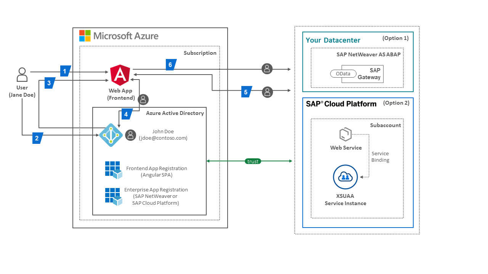

# Tutorial: Secure principal propagation between Azure Active Directory and SAP

In this tutorial, you'll learn how to implement secure principal propagation between Azure Active Directory (Azure AD) and SAP. The tutorial offers two options:

* Option 1: Integrate with SAP NetWeaver to consume an OData service
* Option 2: Integrate with SAP Cloud Platform to consume a RESTful service

No matter which option you choose, you will learn about the following topics in detail:

* Configuration of an web application on Azure which invokes a service or web API from an SAP backend system that requires single sign-on (SSO) with an authenticated user
* Setup of the SAP backend system to enable the web application to silently acquire a token without requiring user interface (UI) interaction by the user
* Secure propagation of the delegated user identity and permissions through the request chain.

To learn more about SaaS app integration with Azure AD, see [What is application access and single sign-on with Azure Active Directory](https://docs.microsoft.com/azure/active-directory/manage-apps/what-is-single-sign-on).

## Prerequisites

To get started, you need the following items:

* An Azure AD subscription. If you don't have a subscription, you can get a [free account](https://azure.microsoft.com/free/).
* For option 1, an SAP NetWeaver Application Server ABAP (AS ABAP) with the SAP Gateway development framework add-on installed. Have a look at the [SAP Cloud Appliance Library](https://cal.sap.com/catalog#/solutions/56fea1da-3460-4398-bc75-c612a4bc345e) or the [SAP NetWeaver AS ABAP Developer Edition](https://blogs.sap.com/2019/07/01/as-abap-752-sp04-developer-edition-to-download/) for deployment options.
* For option 2, an SAP Cloud Platform account. A trial account is sufficient for this tutorial and can be obtained for [free from here](https://cloudplatform.sap.com/try.html).
* You are going to use Postman to send our GET- and POST-Requests, please download it [here](https://www.postman.com/downloads/) and use [Postman Learning](https://learning.postman.com/getting-started/) to familiarize yourself with the tool.
* For option 1, an existing user in Azure AD with the same email address as the user in the SAP NetWeaver system.

## Scenario description

Modern applications running in the Cloud typically consist of many independent (micro)services.
This architectural style enables them to rapidly respond to market conditions.
However, such highly distributed systems also come with challenges e.g. their increased communication overhead and additional operational complexity.

Let’s start with a simplified scenario of a web application that consists of a frontend component and a backend component. The frontend also orchestrates the invocation of services in the backend implementing the core business logic.
Users are authenticated at the frontend by entering their credentials into a login form, or the frontend may delegate this task to a third party, also known as an identity provider (IdP), enabling a single sign-on (SSO) experience for the user.

> [!NOTE] In all cases, the user is authenticated at the frontend and when the frontend invokes a backend service, the service usually requires the user to be authenticated before accessing any data in the backend. The authenticated user is a precondition to enforce any authorization rules in the backend. Thus a single sign-on is essential both from a security and user experience perspective, and the frontend securely and *silently* (i.e. without any UI interaction by the user for authentication) forwards or propagates the already authenticated user to the backend to provide a secure and seamless experience. This mechanism is also referred to as user or ***principal propagation***.

The goal of this scenario is to connect a Single Page Application (SPA) using the Azure Active Directory Tenant via OAuth 2.0 and the [SAML Bearer Assertion Flow](https://tools.ietf.org/html/rfc7522) to retrieve the user's data in SAP. Using these protocols helps to avoid any UI interaction by the user to authenticate the call to SAP.

## Description of the Tutorial

1. Integrate SAP NetWeaver (Option 1) or SAP Cloud Platform (Option 2) with Azure AD.
1. Build a modern architecture using OAuth 2.0 protocols und call SAP services using single sign-on without requiring further user interface (UI) interaction by the user.
1. Integrate the single page application in Microsoft Teams.



## Underlying concepts

The end-to-end process of a user authenticating at the frontend and accessing the user's data in the backend needs the following steps to perform authorization checks:

1. The user (Jane Doe, jdoe@contoso.com) accesses a protected resource of the frontend (written in JavaScript using popular UI frameworks such as Angular) in the web application e.g. an App Service instance in an Azure subscription. The web application’s frontend is registered in the subscription’s Azure AD  tenant and in this scenario it is called Angular FE/Client Application. An API application also registered in the Azure AD tenant simulates the controller logic and delegates authentication to the tenant.
1. The user's browser is redirected by the API application to the Azure AD tenant’s OAuth authorization endpoint ```(https://login.microsoftonline.com/<TENANT_ID>/oauth2/v2.0/authorize)```. Now the user is entering their credentials and is giving consent to the requested permissions or *scopes* of the API application.
1. Once the user is successfully authenticated, the user's browser receives the access token in response from the authorization endpoint if the app is registered for the OAuth implicit grant flow in AAD. The OAuth implicit grant flow simplifies obtaining the access token for modern apps that implement an SPA frontend. Otherwise, the application uses the authorization code grant flow, where Azure AD first sends back an authorization code to the application which it redeems for an access token and refresh token by sending a POST request to the tenant’s token endpoint.
 ```(https://login.microsoftonline.com/<TENANT_ID>/oauth2/v2.0/token)```
1. The frontend now has a session established for the user based on the information contained in the access token from Azure AD. This token cannot be used to authorize the call to the backend service in SAP NetWeaver (Option 1) or SAP Cloud Platform (Option 2). Services in SAP only accept access tokens issued by their trusted OAuth Authorization Server. SAP OAuth Authorization Server accept the SAML Bearer Grant type, which allows the API App in Microsoft Azure to request an OAuth access token from SAP with a SAML 2.0 assertion. Azure AD provides a SAML assertion by receiving an OAuth access token (issued by the Azure AD tenant to the authenticated user before) in exchange. This feature is a [non-standard extension to the On-Behalf-Of (OBO) flow](https://docs.microsoft.com/en-us/azure/active-directory/azuread-dev/v1-oauth2-on-behalf-of-flow#saml-assertions-obtained-with-an-oauth20-obo-flow) in Azure AD.
1. The API App is using the SAML 2.0 assertion by sending a POST request to the SAP OAuth Authorization Server to receive an access token from SAP.
1. Once the SAML assertion is exchanged with an access token, the final GET or POST request can be send to e.g. service from SAP using the access token to authorize tha call on behalf of the logged-in user in Azure.

> [!NOTE] To securely propagate the principal across different platforms and clouds, interoperability at the communication protocol and security token format level are key to the security architecture of the solution. A central standard addressing this scenario for principal propagation is specified in [**RFC 7522**, the Security Assertion Markup Language (SAML) 2.0 Profile for OAuth 2.0 Client Authentication and Authorization Grants](https://tools.ietf.org/html/rfc7522). This extension to the OAuth 2.0 framework combines the interoperable and mature security token format from the SAML 2.0 standard with a simple request/response protocol from OAuth 2.0. Essentially, it describes how a client (in this scenario the web application frontend) accessing an OAuth-protected resource (the backend service) can obtain an OAuth access token from an OAuth authorization server by presenting a valid SAML assertion as the authorization grant. In this process, the user is not required to approve the token issuance at the authorization server, which makes RFC 7522 the ideal candidate for this scenario. Other authorization grants of the OAuth 2.0 framework such as the authorization code ask for the user’s explicit permission to allow a client application to access resources on behalf of the user.

The steps in the scenario can be mapped to the the following technical protocol flow:

1. Authenticate user (Jane Doe, jdoe@contoso.com) and get an *access token (issued by AAD)* with the OAuth2 Implicit Flow​.
1. Exchange the *AAD access token* with a *SAML 2.0 Assertion (issued by AAD)* using the OAuth On Behalf Of Flow.
1. Acquire an *OAuth access token (issued by SAP OAuth Authorization Server in SCP or SAP NetWeaver*) for accessing e.g the SAP service by exchanging the SAML Assertion using the SAML Bearer Assertion Flow​.
1. Send a GET or POST request to e.g. the SAP OData service with the acquired *OAuth access token (issued by OAuth Authorization Server of SAP*) in the HTTP Authorization Header​.

From a setup perspective, the scenario requires the following steps:

|Topic|Description|
|:-----------|:------------------|
|[Azure AD Configuration](././AzureActiveDirectoryConfiguration/README.md)|Create user, register applications (Frontend App, Enterprise App), export SAML metadata for trust configuration in SAP|
|[Option 1: SAP NetWeaver Configuration](SAPNetWeaverConfiguration/README.md)|Generate user, setup federation an trust between SAP NetWeaver and Azure AD, setup OData service, configure OAuth client, configure scopes|
|[Option 2: SAP Cloud Platform Configuration](SAPCloudPlatformConfiguration/README.md)|Deploy web service in SCP, setup federation and trust between SCP and Azure AD, obtain OAuth client credentials from service binding|
|[Postman SetUp](././PostmanSetup/README.md)|GET request to receive access token from Azure Active Directory (Implicit Grant Flow), POST Request to receive SAML Assertion from Azure Active Directory (On Behalf Flow), POST Request using SAML Assertion to receive access token from SAP (SAML Bearer Assertion Flow), GET Request using access token to receive the user's data from SAP to view in application|

## Additional resources

- [ List of Tutorials on How to Integrate SaaS Apps with Azure Active Directory ](https://docs.microsoft.com/azure/active-directory/active-directory-saas-tutorial-list)

- [What is application access and single sign-on with Azure Active Directory? ](https://docs.microsoft.com/azure/active-directory/active-directory-appssoaccess-whatis)

- [What is conditional access in Azure Active Directory?](https://docs.microsoft.com/azure/active-directory/conditional-access/overview)

- [Try Visibly with Azure AD](https://aad.portal.azure.com/)

- [What is session control in Microsoft Cloud App Security?](https://docs.microsoft.com/cloud-app-security/proxy-intro-aad)
- https://blogs.sap.com/2020/07/17/principal-propagation-in-a-multi-cloud-solution-between-microsoft-azure-and-sap-cloud-platform-scp/