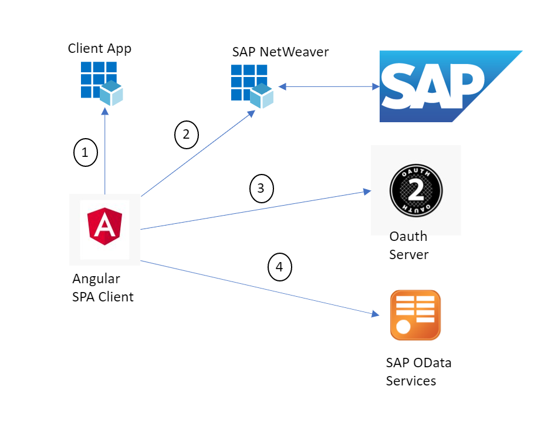

# Azure Active Directory Identity connecting seamlessly to SAP Odata Service

Modern business applications running in the Cloud typically consist of many independent (micro)services. 
This architectural style enables them to rapidly respond to market conditions. 
However, such highly distributed systems also come with challenges e.g. their increased communication overhead and additional operational complexity. 

Let’s start with a simplified scenario of a business application that consists of a frontend component serving web pages to the end users accessing it via their web browser. The frontend also orchestrates the invocation of services in the backend implementing the core business logic.

Users are authenticated at the frontend by entering their credentials into a login form, or the frontend may delegate this task to a third party, also known as an identity provider (IdP), enabling a single sign-on (SSO) experience to the user.

The longterm goal of this scenario is to connect a single page application integrated in Microsoft Teams using the Azure Active Directory Tenant via Open ID Connect and OAuth2 displaying content from SAP. Important to mention is that a single sign on experience will be provided. 

Here you can see the future state of the solution:

1. We want to integrate SAP Netweaver with Azure Active Directory
2. We want to build a modern architecture using OAuth2 protocols und to be able to call SAP OData Services
3. In the end we want to integrate the single page application in Teams. 

The initial challenge was to be able to connect an azure application with SAP for enterprise customers. But we didn't want to use the SAML-P protocol, but using modern authentication and authorization protocols.

We solved this challenge in iterations. Thus we first looked at the scenario connecting the single page application using the Azure Active Directory directly to SAP Netweaver.

The first iteration of the solution:

To go into the technical details we have listed the steps of the further integration of AAD, SAP and the application. 

1. Authenticate user and get an access token (bearer token) with the OAuth2 Implicit Flow​
2. Exchange the bearer token with a SAML 2.0 Assertion with the Oauth On Behalf Of Flow   (Bearer SAML Assertion Flow)​
3. Akquire an Oauth bearer token for SAP Odata Service with the SAML Bearer Assertion Flow​
4. Call SAP Odata service with acquired Bearer Token in Authotization Header​

|Topic|Description|
|:-----------|:------------------|
|[SAP Configuration](././SAPConfiguration/README.md)|Generate User, Federation between SAP and Azure Active Directory, Configure Client in SAP, Configure Scopes in SAP|
|[Azure Active Directory Configuration](././AzureActiveDirectoryConfiguration/README.md)|Register Application (Client App), Register Enterprise Application (Backend: SAP NetWeaver), Configure registered Applications in Azure Active Directory|
|[Postman SetUp](././PostmanSetup/README.md)|GET Request to receive access token from Azure Active Directory (Implicit Grant Flow), POST Request to receive SAML Assertion from Azure Active Directory (On Behalf Flow), POST Request using SAML Assertion to receive access token from SAP (SAML Bearer Assertion Flow), GET Request using access token to receive the product data from SAP to view in application|

## SAP Configuration

|Topic|Description|
|:-----------|:------------------|
|[Generate User]()|A Dialog User needs to be generated in the SAP System.|
|[Federation between SAP and Azure Active Directory]()|A federation needs to be configured between SAP and Azure Active Directory|
|[Configure Client in SAP]()|A Client needs to be configured within the SAP|
|[Configure Scopes in SAP]()|The Scopes need to be configured to be able to access certain ODATA Services|

## Azure Active Directory Configuration
|Topic|Description|
|:-----------|:------------------|
|[Register Application (Client App)]()|A frontend Application|
|[Register Enterprise Application (Backend: SAP NetWeaver)]()|What needs to be done|
|[Configure registered Applications in Azure Active Directory]()|What needs to be done|

## Postman SetUp

|Topic|Description|
|:-----------|:------------------|
|[**GET** Request to receive access token from Azure Active Directory  (Implicit Grant Flow)]()|What needs to be done|
|[**POST** Request to receive SAML Assertion from Azure Active Directory   (On Behalf Flow)]()|What needs to be done|
|[**POST** Request using SAML Assertion to receive access token from SAP  (SAML Bearer Assertion Flow)]()|What needs to be done|
|[**GET** Request using access token to receive the product data from SAP   to view in application]()|What needs to be done|

