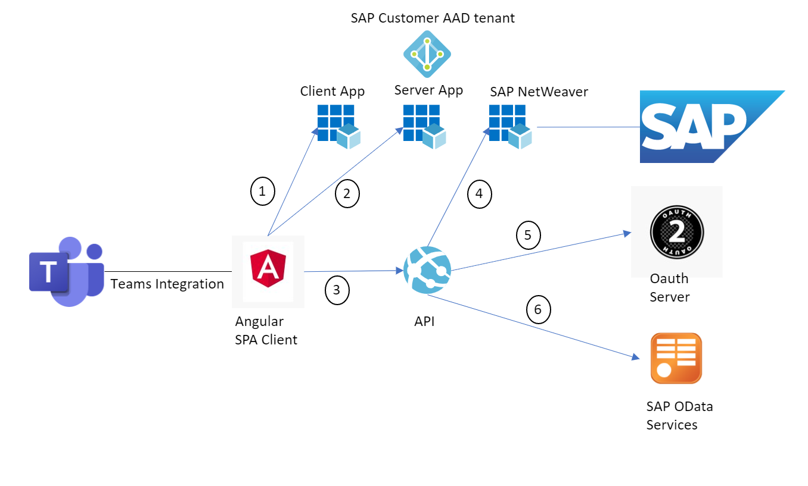
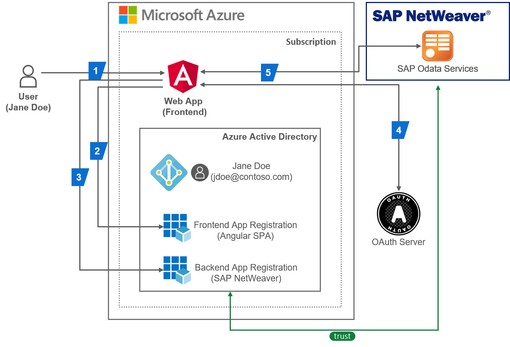

# Azure Active Directory Identity connecting seamlessly to SAP Odata Service

  > **Introduction** <br>
  > Modern applications running in the Cloud typically consist of many independent (micro)services. 
  > This architectural style enables them to rapidly respond to market conditions. 
  > However, such highly distributed systems also come with challenges e.g. their increased communication overhead and additional operational complexity. 
  > 
  > Let’s start with a simplified scenario of a web application that consists of a frontend component and a backend component. The frontend also orchestrates the invocation of services in the backend implementing the core business logic.
  > 
  > Users are authenticated at the frontend by entering their credentials into a login form, or the frontend may delegate this task to a third party, also known as an identity provider (IdP), enabling a single sign-on (SSO) experience to the user.
  > 
  > In all cases, the user is authenticated at the frontend and when the frontend invokes a backend service, the service usually requires the user to authenticate before accessing any data in the backend. The authenticated user is a precondition to enforce any authorization rules in the backend. Thus a single sign on is essential both from a security and user experience perspective. Thus the frontend securely forwards the user to the backend to provide a secure and seamless experience. 
  > 
  > The goal of this scenario is to connect a single page application integrated in Microsoft Teams using the Azure Active Directory Tenant via OAuth2 and the SAML Bearer Assertion Flow to be able to display content from SAP. The challenge was to be able to connect an azure application with SAP for enterprise customers using using modern authentication and authorization protocols instead of the SAML-P protocol. Important to mention is that a single sign on experience will be provided. 

Here you can see the final scenario of this solution:



**Description of the Challenge**

```
1. We want to integrate SAP Netweaver with Azure Active Directory
2. We want to build a modern architecture using OAuth2 protocols und to be able to call SAP OData Services using singe sign on
3. In the end we want to integrate the single page application in Teams. 
```
But as always we divided the problem into parts and solved this challenge in iterations. <br> 
Thus we first looked at the scenario connecting the single page application using the Azure Active Directory directly to SAP Netweaver.

The **first iteration** of the solution:



 > **Underlying concepts** <br>
 >
 > The end-to-end process of a user authenticating at the frontend and accessing the user's data in the backend needs the following steps to perform authorization checks:
 1. > The user (Jane Doe, jdoe@contoso.com) accesses a protected resource of the frontend (written in JavaScript using popular frameworks such as Angular) in the web application e.g. an App Service instance in an Azure subscription. The web application’s frontend is registered in the subscription’s Azure Active Directory (AAD) tenant as an application to delegate authentication to the tenant.
 2. > The user's browser is redirected by the web application to the AAD tenant’s OAuth authorization endpoint <br> ```(https://login.microsoftonline.com/<tenant_id>/oauth2/v2.0/authorize)``` <br> Now the user is inserting his/her credentials and is giving consent to the requested permissions or “scopes” of the web application.
 3. > Once the user is successful authenticated, the user's browser receives the access token in response from the authorization endpoint if the app is registered for the OAuth implicit grant flow in AAD, which simplifies obtaining the access token for modern apps that implement a single-page app (SPA) frontend. Otherwise, the app uses the authorization code grant flow, where AAD first sends back an authorization code to the app which it redeems for an access token and refresh token by sending a POST request to the tenant’s token endpoint <br> ```(https://login.microsoftonline.com/<tenant_id>/oauth2/v2.0/token)```
 4. > The frontend now has a session established for the user based on the information contained in the access token from AAD. This token cannot be used to authorize the call to the backend service in SAP Netweaver. Services in SAP Netweaver only accept access tokens issued by their trusted OAuth Authorization Server. The OAuth Authorization Server accepts the SAML Bearer Grant type, which allows the frontend in Microsoft Azure to request an OAuth access token from SAP Netweaver with a SAML 2.0 assertion. AAD provides a SAML assertion by receiving an OAuth access token (issued by the AAD to the authenticated user before) in exchange. This feature is a non-standard extension to the On-Behalf-Of (OBO) flow in AAD. 
 5. > Then the application is using the SAML 2.0 assertion by sending a POST to the SAP Netweaver to receive an access token from the OAuth Authorization Server of SAP. Once the SAML assertion is exchanged by an access token. The final GET or POST can be send to SAP Netweaver e.g. SAP Odata Services using the access token to be able to display or change the Data. 
 >

To go into the technical details we have summarized the steps of the further integration of AAD, SAP and the application. 

1. Authenticate user (Jane Doe, jdoe@contoso.com) and get an *access token (issued by AAD)* <br> with the OAuth2 Implicit Flow​
2. Exchange the *AAD access token* with a *SAML 2.0 Assertion (issued by AAD)* <br> with the Oauth On Behalf Of Flow (Bearer SAML Assertion Flow)​
3. Akquire an *OAuth access token (issued by  OAuth Authorization Server of SAP*) for accessing the SAP Netweaver e.g SAP Odata Service by exchanging the SAML Assertion <br> with the SAML Bearer Assertion Flow​
4. Send a GET or POST to the SAP Netweaver e.g SAP Odata service with acquired *OAuth access token (issued by OAuth Authorization Server of SAP*) in the Authotization Header​

Below you can redirect to the administrative configuration parts of this documentation.
1. Firstly you should configure your SAP Netweaver
2. Secondly you should configure your Azure Active Directory
3. And last but not least you should configure Postman and test the whole scenario.

|Topic|Description|
|:-----------|:------------------|
|[SAP Configuration](././SAPConfiguration/README.md)|Generate User, Federation between SAP and Azure Active Directory, Configure Client in SAP, Configure Scopes in SAP|
|[Azure Active Directory Configuration](././AzureActiveDirectoryConfiguration/README.md)|Register Application (Client App), Register Enterprise Application (Backend: SAP NetWeaver), Configure registered Applications in Azure Active Directory|
|[Postman SetUp](././PostmanSetup/README.md)|GET Request to receive access token from Azure Active Directory (Implicit Grant Flow), POST Request to receive SAML Assertion from Azure Active Directory (On Behalf Flow), POST Request using SAML Assertion to receive access token from SAP (SAML Bearer Assertion Flow), GET Request using access token to receive the product data from SAP to view in application|

For the **second iteration** we will add a backend API (Application Programming Interface) to the scenario and direct you to our existing Teams integration documentation