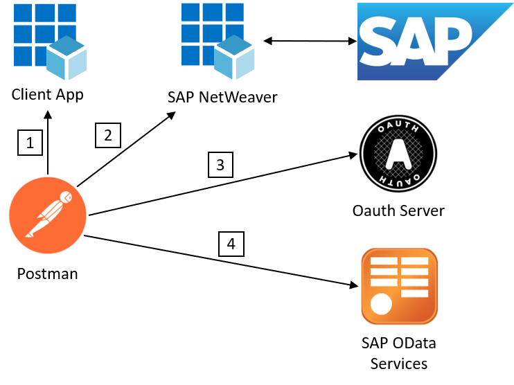

# Azure Active Directory Identity connecting seamlessly to SAP Odata Service

The longterm goal of this scenario is to connect a single page application integrated in Microsoft Teams using the Azure Active Directory Tenant via Open ID Connect and OAuth2 displaying content from SAP. Important to mention is that a single sign on experience will be provided. 

The current state of the solution:

1. Authenticate user and get an access token (bearer token) with the OAuth2 Implicit Flow​
2. Exchange the bearer token with a SAML 2.0 Assertion with the Oauth On Behalf Of Flow   (Bearer SAML Assertion Flow)​
3. Akquire an Oauth bearer token for SAP Odata Service with the SAML Bearer Assertion Flow​
4. Call SAP Odata service with acquired Bearer Token in Authotization Header​

|Topic|Description|
|:-----------|:------------------|
|[SAP Configuration](././SAPConfiguration/README.md)|Generate User, Federation between SAP and Azure Active Directory, Configure Client in SAP, Configure Scopes in SAP|
|[Azure Active Directory Configuration](././AzureActiveDirectoryConfiguration/README.md)|Register Application (Client App), Register Enterprise Application (Backend: SAP NetWeaver), Configure registered Applications in Azure Active Directory|
|[Postman SetUp](././PostmanSetup/README.md)|GET Request to receive access token from Azure Active Directory (Implicit Grant Flow), POST Request to receive SAML Assertion from Azure Active Directory (On Behalf Flow), POST Request using SAML Assertion to receive access token from SAP (SAML Bearer Assertion Flow), GET Request using access token to receive the product data from SAP to view in application|

## SAP Configuration

|Topic|Description|
|:-----------|:------------------|
|[Generate User]()|What needs to be done|
|[Federation between SAP and Azure Active Directory]()|What needs to be done|
|[Configure Client in SAP]()|What needs to be done|
|[Configure Scopes in SAP]()|What needs to be done|

## Azure Active Directory Configuration
|Topic|Description|
|:-----------|:------------------|
|[Register Application (Client App)]()|What needs to be done|
|[Register Enterprise Application (Backend: SAP NetWeaver)]()|What needs to be done|
|[Configure registered Applications in Azure Active Directory]()|What needs to be done|

## Postman SetUp

|Topic|Description|
|:-----------|:------------------|
|[**GET** Request to receive access token from Azure Active Directory  (Implicit Grant Flow)]()|What needs to be done|
|[**POST** Request to receive SAML Assertion from Azure Active Directory   (On Behalf Flow)]()|What needs to be done|
|[**POST** Request using SAML Assertion to receive access token from SAP  (SAML Bearer Assertion Flow)]()|What needs to be done|
|[**GET** Request using access token to receive the product data from SAP   to view in application]()|What needs to be done|

