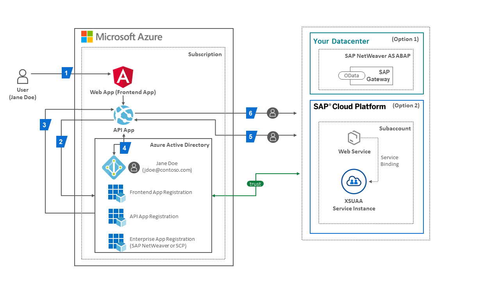

# Tutorial: Azure Active Directory single sign-on (SSO) integration with SAP

In this tutorial, you'll learn how to integrate SAP with Azure Active Directory (Azure AD). When you integrate SAP with Azure AD, you can:

* Control in Azure AD who has access to SAP.
* Enable your users to be automatically signed-in to SAP with their Azure AD accounts.
* Manage your accounts in one central location - the Azure portal.

To learn more about SaaS app integration with Azure AD, see [What is application access and single sign-on with Azure Active Directory](https://docs.microsoft.com/azure/active-directory/manage-apps/what-is-single-sign-on).

## Prerequisites

To get started, you need the following items:

* An Azure AD subscription. If you don't have a subscription, you can get a [free account](https://azure.microsoft.com/free/).
* SAP single sign-on (SSO) enabled subscription.
* We are going to use Postman to send our GET- and POST-Requests, please download it [here](https://www.postman.com/downloads/) and use [Postman Learning](https://learning.postman.com/getting-started/) to familiarize yourself with the tool. <br>


## Scenario description
  > Modern applications running in the Cloud typically consist of many independent (micro)services. <br>
  > This architectural style enables them to rapidly respond to market conditions. <br>
  > However, such highly distributed systems also come with challenges e.g. their increased communication overhead and additional operational complexity.
>
  > Let’s start with a simplified scenario of a web application that consists of a frontend component and a backend component. The frontend also orchestrates the invocation of services in the backend implementing the core business logic. <br>
  > Users are authenticated at the frontend by entering their credentials into a login form, or the frontend may delegate this task to a third party, also known as an identity provider (IdP), enabling a single sign-on (SSO) experience for the user. <br>
>
  > In all cases, the user is authenticated at the frontend and when the frontend invokes a backend service, the service usually requires the user to be authenticated before accessing any data in the backend. The authenticated user is a precondition to enforce any authorization rules in the backend. Thus a single sign on is essential both from a security and user experience perspective. Thus the frontend securely forwards the user to the backend to provide a secure and seamless experience.  <br>
  > The goal of this scenario is to connect a single page application integrated in Microsoft Teams using the Azure Active Directory Tenant via OAuth2 and the SAML Bearer Assertion Flow to display content from SAP. The challenge was to connect an azure application with SAP for enterprise customers using modern authentication and authorization protocols instead of the SAML-P protocol. Important to mention is that a single sign on experience will be provided. 

## Description of the Tutorial

1. Integrate SAP Netweaver with Azure Active Directory
2. Build a modern architecture using OAuth2 protocols und call SAP OData Services using single sign on
3. Untegrate the single page application in Microsoft Teams 
<br>
We looked at the scenario connecting the single page application via an API using the Azure Active Directory directly to SAP Netweaver.

The **first iteration** of the solution:



 ## Underlying concepts
 The end-to-end process of a user authenticating at the frontend and accessing the user's data in the backend needs the following steps to perform authorization checks: <br>

 1. The user (Jane Doe, jdoe@contoso.com) accesses a protected resource of the frontend (written in JavaScript using popular frameworks such as Angular) in the web application e.g. an App Service instance in an Azure subscription. The web application’s frontend is registered in the subscription’s Azure Active Directory (AAD) tenant and in this scenario it is called Angular FE/Client Application. An API application also registered in the AAD will hold the business intelligence and delegate authentication to the tenant. <br>
<br>
 2. The user's browser is redirected by the API application to the AAD tenant’s OAuth authorization endpoint <br> ```(https://login.microsoftonline.com/<TENANT_ID>/oauth2/v2.0/authorize)``` <br> Now the user is inserting their credentials and is giving consent to the requested permissions or *scopes* of the API application. <br>
<br>
 3. Once the user is successfully authenticated, the user's browser receives the access token in response from the authorization endpoint if the app is registered for the OAuth implicit grant flow in AAD. The OAuth implicit grant flow simplifies obtaining the access token for modern apps that implement a single-page application (SPA) frontend. Otherwise, the application uses the authorization code grant flow, where AAD first sends back an authorization code to the application which it redeems for an access token and refresh token by sending a POST request to the tenant’s token endpoint. <br> ```(https://login.microsoftonline.com/<TENANT_ID>/oauth2/v2.0/token)``` <br>
<br>
 4. The frontend now has a session established for the user based on the information contained in the access token from AAD. This token cannot be used to authorize the call to the backend service in SAP Netweaver. Services in SAP Netweaver only accept access tokens issued by their trusted OAuth Authorization Server. The OAuth Authorization Server accepts the SAML Bearer Grant type, which allows the frontend in Microsoft Azure to request an OAuth access token from SAP Netweaver with a SAML 2.0 assertion. AAD provides a SAML assertion by receiving an OAuth access token (issued by the AAD to the authenticated user before) in exchange. This feature is a non-standard extension to the On-Behalf-Of (OBO) flow in AAD. <br>
<br>
 5. Then the application is using the SAML 2.0 assertion by sending a POST request to SAP Netweaver to receive an access token from the OAuth Authorization Server of SAP. Once the SAML assertion is exchanged with an access token, the final GET or POST request can be send to e.g. the SAP Odata Services of SAP Netweaver using the access token to be able to read or write Data. 
<br>
<br>

To go into the technical details we have summarized the steps of the further integration of AAD, SAP and the application. 

1. Authenticate user (Jane Doe, jdoe@contoso.com) and get an *access token (issued by AAD)* with the OAuth2 Implicit Flow​
2. Exchange the *AAD access token* with a *SAML 2.0 Assertion (issued by AAD)* using the Oauth On Behalf Of Flow (Bearer SAML Assertion Flow)​
3. Akquire an *OAuth access token (issued by  OAuth Authorization Server of SAP*) for accessing e.g the SAP Odata Service by exchanging the SAML Assertion using the SAML Bearer Assertion Flow​
4. Send a GET or POST request to e.g. the SAP Odata service with the acquired *OAuth access token (issued by OAuth Authorization Server of SAP*) in the Authotization Header​

<br>

This translates into these three steps:

1. First configure Azure Active Directory
2. Second configure SAP NetWeaver
3. Last but not least configure Postman and test the whole scenario.

<br>

|Topic|Description|
|:-----------|:------------------|
|[Azure Active Directory Configuration](././AzureActiveDirectoryConfiguration/README.md)|Register Applications (Client App), <br> Register Application (API App), <br>Register Enterprise Application (Backend: SAP NetWeaver)|
|[SAP Configuration](SAPNetWeaverConfiguration/README.md)|Generate User, <br>Create Federation between SAP and Azure Active Directory, <br>Configure Client in SAP, <br>Configure Scopes in SAP|
|[Postman SetUp](././PostmanSetup/README.md)|GET request to receive access token from Azure Active Directory (Implicit Grant Flow), <br>POST Request to receive SAML Assertion from Azure Active Directory (On Behalf Flow), <br>POST Request using SAML Assertion to receive access token from SAP (SAML Bearer Assertion Flow), <br>GET Request using access token to receive the product data from SAP to view in application|


<br>

## Additional resources

- [ List of Tutorials on How to Integrate SaaS Apps with Azure Active Directory ](https://docs.microsoft.com/azure/active-directory/active-directory-saas-tutorial-list)

- [What is application access and single sign-on with Azure Active Directory? ](https://docs.microsoft.com/azure/active-directory/active-directory-appssoaccess-whatis)

- [What is conditional access in Azure Active Directory?](https://docs.microsoft.com/azure/active-directory/conditional-access/overview)

- [Try Visibly with Azure AD](https://aad.portal.azure.com/)

- [What is session control in Microsoft Cloud App Security?](https://docs.microsoft.com/cloud-app-security/proxy-intro-aad)
- https://blogs.sap.com/2020/07/17/principal-propagation-in-a-multi-cloud-solution-between-microsoft-azure-and-sap-cloud-platform-scp/