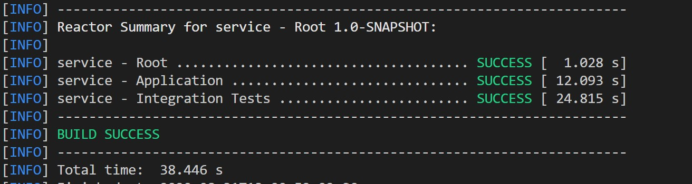
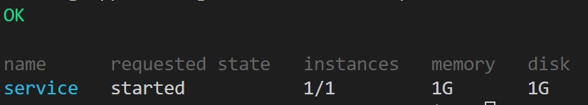
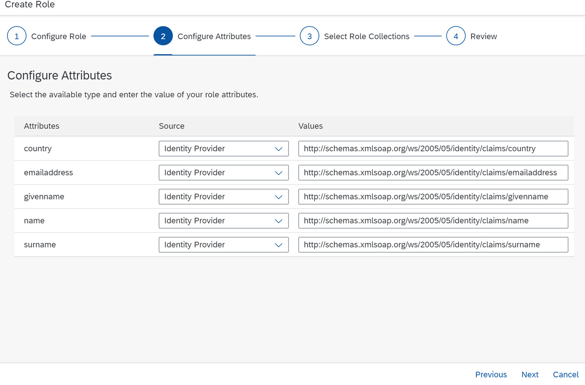
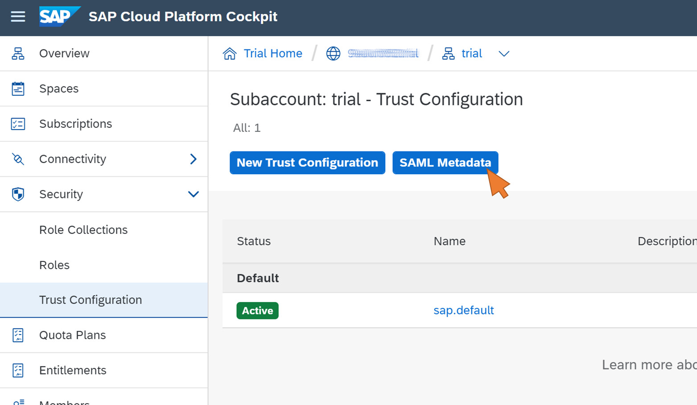
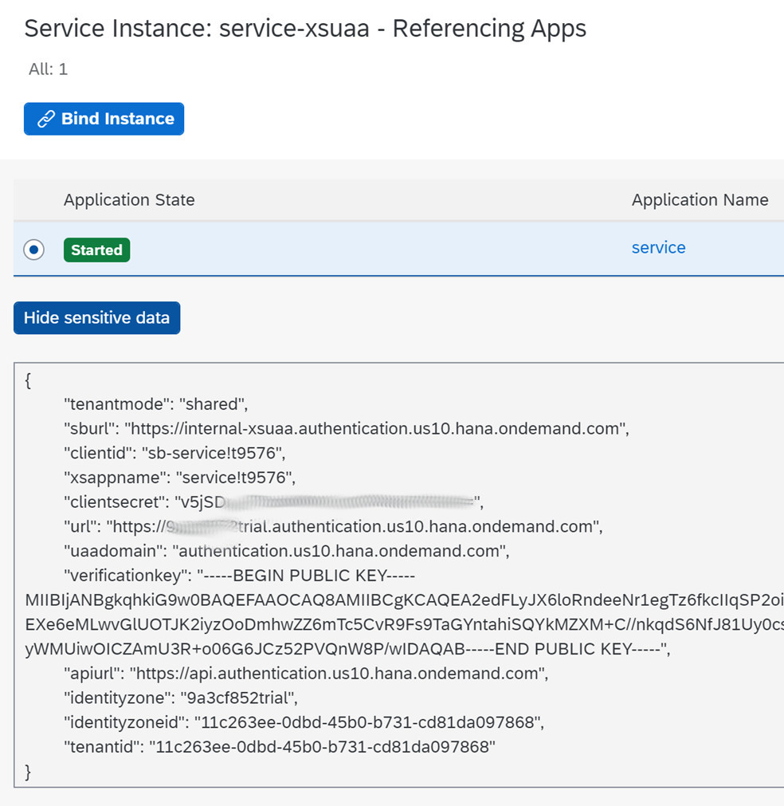
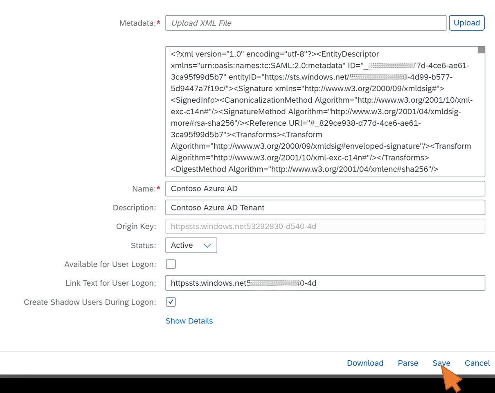

# SAP Cloud Platform (SCP) Configuration

## Prerequisites

Please make sure that your local development environment meets the following prerequisites:

* Create a free trial account on SCP. For more detail, visit [https://cloudplatform.sap.com/try.html](https://cloudplatform.sap.com/try.html)
* Download and install the [Cloud Foundry CLI](https://github.com/cloudfoundry/cli)
* Download and install the latest version of [Maven](http://maven.apache.org/download.cgi)
* Download and install a Java Development Kit (JDK) Version 8 or later

## Deployment of the backend service

You will use Maven to create the Java project structure for your backend service in SCP, and add the code for a simple Java servlet returning the propagated user's name and attributes.

1. Generate the project structure from Maven archetype
    1. Create a new directory and switch to it.
    1. Run the command ```mvn archetype:generate "-DarchetypeGroupId=com.sap.cloud.sdk.archetypes" "-DarchetypeArtifactId=scp-cf-tomee" "-DarchetypeVersion=RELEASE"``` to create the project inside the new directory. More details on the generated project structure can be found [here](https://developers.sap.com/tutorials/s4sdk-cloud-foundry-sample-application.html#a17968d8-ea0b-48e2-888c-6ef9aca9067b)
    1. Maven will require the following parameters:
        * `groupId`: An identifier representing your group, company or organization (e.g. `com.contoso.sample`)
        * `artifactId`: An identifier for your application (e.g. `service`)
        * `version`: The version of your application (e.g. `1.0-SNAPSHOT`)
        * `package`:The top-level package your backend service source code will reside in (typically equal to your `groupId`)
1. In the `\service\application\src\main\java\com\contoso\sample` directory, open the file `HelloWorldServlet.java` and replace the content of the file with the following code snippet:

    ```java
    package com.contoso.sample;
    
    import java.io.IOException;
    import java.util.Iterator;
    
    import javax.servlet.annotation.HttpConstraint;
    import javax.servlet.annotation.ServletSecurity;
    import javax.servlet.annotation.WebServlet;
    import javax.servlet.http.HttpServlet;
    import javax.servlet.http.HttpServletRequest;
    import javax.servlet.http.HttpServletResponse;
    
    import com.sap.cloud.sdk.cloudplatform.security.Authorization;
    import com.sap.cloud.sdk.cloudplatform.security.principal.CollectionPrincipalAttribute;
    import com.sap.cloud.sdk.cloudplatform.security.principal.DefaultPrincipal;
    import com.sap.cloud.sdk.cloudplatform.security.principal.DefaultPrincipalFacade;
    import com.sap.cloud.sdk.cloudplatform.security.principal.Principal;
    import com.sap.cloud.sdk.cloudplatform.security.principal.PrincipalAttribute;
    import com.sap.cloud.sdk.cloudplatform.security.principal.StringPrincipalAttribute;
    
    import io.vavr.control.Try;
    
    @WebServlet("/hello")
    @ServletSecurity(@HttpConstraint(rolesAllowed = { "Display" }))
    public class HelloWorldServlet extends HttpServlet
    {
        private static final long serialVersionUID = 1L;
    
        @Override
        protected void doGet( final HttpServletRequest request, final HttpServletResponse response )
            throws IOException
        {        
            Try<Principal> currentUser = new DefaultPrincipalFacade().tryGetCurrentPrincipal();    
            if (currentUser.isSuccess()) {
                DefaultPrincipal defaultCurrentUser = (DefaultPrincipal)currentUser.get();            
                response.getWriter().println("Hello " + defaultCurrentUser.getPrincipalId());
                Iterator<PrincipalAttribute> i = defaultCurrentUser.getAttributes().values().iterator();
                while (i.hasNext()) {
                    CollectionPrincipalAttribute<StringPrincipalAttribute> attribute = (CollectionPrincipalAttribute<StringPrincipalAttribute>) i.next();                
                    response.getWriter().println("Attribute: " + attribute.getName() + ", Value: " + attribute.getValues().iterator().next());
                }
                Iterator<Authorization> j = ((DefaultPrincipal)currentUser.get()).getAuthorizations().iterator();
                while (j.hasNext()) {
                    Authorization scope = (Authorization)j.next();
                    response.getWriter().println("Scope: " + scope.getName());
                }
            } else {
                response.getWriter().println("No authenticated user");
            }
    
        }
    }
    ```

1. Open the file `manifest.yml` in the `\service` directory, and add the following lines at the end of the file. Replace `YOUR TRIAL ACCOUNT NAME` with the domain of your SCP trail account, e.g. `98abcd76trial`, and `YOUR TRIAL LANDSCAPE` with the domain name of trial account landscape, e.g. `us10`.

    ```yml
    routes:
        - route: service-<YOUR TRIAL ACCOUNT NAME>.cfapps.<YOUR TRIAL LANDSCAPE>.hana.ondemand.com
    services:
        - service-xsuaa
    ```

1. Create a new file `xs-security.json` in the `\service` directory with the following content:

    ```json
    {
        "xsappname": "service",
        "tenant-mode": "shared",
        "scopes": [
          {
            "name": "$XSAPPNAME.Display",
            "description": "display"
          }
        ],
        "role-templates": [
          {
            "name": "Viewer",
            "description": "Required to read data",
            "scope-references"     : [
              "$XSAPPNAME.Display"
            ],
            "attribute-references": [
              "givenname", "surname", "emailaddress", "name", "country"
            ]
          }
        ],
        "attributes" : [
          { 
           "name" : "givenname", 
           "description" : "Given name",
           "valueType" : "string" },
          {
           "name" : "surname", 
           "description" : "Last name",
           "valueType" : "string" },
          {
            "name" : "emailaddress",
            "description" : "Email address",
            "valueType" : "string" },
          {
            "name" : "name", 
            "description" : "User name",
            "valueType" : "string" },
          {
            "name" : "country", 
            "description" : "Country",
            "valueType" : "string" }
        ]
    }
    ```

1. Replace the file web.xml in the directory `service\application\src\main\webapp\WEB-INF` with the following content:
    ```xml
    <?xml version="1.0" encoding="UTF-8"?>
    <web-app xmlns:xsi="http://www.w3.org/2001/XMLSchema-instance"
             xmlns="http://java.sun.com/xml/ns/javaee"
             xsi:schemaLocation="http://java.sun.com/xml/ns/javaee http://java.sun.com/xml/ns/javaee/web-app_3_0.xsd"
             version="3.0" metadata-complete="false">
    
        <session-config>
            <session-timeout>20</session-timeout>
        </session-config>
    
        <login-config>
            <auth-method>XSUAA</auth-method>
        </login-config>
    
        <security-constraint>
            <web-resource-collection>
                <web-resource-name>Baseline Security</web-resource-name>
                <url-pattern>/*</url-pattern>
            </web-resource-collection>
            <auth-constraint>
                <role-name>*</role-name>
            </auth-constraint>
        </security-constraint>
    
        <security-role>
            <role-name>Display</role-name>
        </security-role>
    </web-app>
    ```
1. Replace the method `testService` in the file `service\integration-tests\src\test\java\com\contoso\sample\HelloWorldServletTest.java` with the following code snippet:

    ```java
    @Test
    public void testService()
    { 
        given().when().get("/hello").then().statusCode(403);
    }
    ```

1. Login to your SCP subaccount. In the following steps we’ll use a trial account on SCP us10 landscape with the command `cf login -a https://api.cf.us10.hana.ondemand.com`
1. Create the XSUAA service instance for the backend service with the command `cf create-service xsuaa application service-xsuaa -c ./xs-security.json`
1. Build the backend service with the command `mvn clean package`

1. Deploy the backend service to your subaccount with the command `cf push`
1. After successful deployment, check that the service has started with the command `cf apps`


## Configuration of role collection
Upon successful deployment of the backend service in SCP, the role and role collection settings for the service must be configured. The role collection is used later in the setup process to assign the permissions to the propagated principal.
1. Open the [SCP Cockpit](https://cockpit.hanatrial.ondemand.com/cockpit) in your browser and login with your account admin. Navigate to the dev space in your trial account and select **Security – Roles** from the left side navigation menu. Click on **+** to create a new role.
1. Enter `Viewer` as the new role name and click **Next**. Continue with the configuration of the role attributes, which were defined by the `Viewer` role template in the `xs-security.json` file. In this scenario, the source of each attribute is the identity provider that originally authenticated the user, so Azure AD. Enter the following source attribute mappings:
    * country: `http://schemas.xmlsoap.org/ws/2005/05/identity/claims/country`
    * emailaddress: `http://schemas.xmlsoap.org/ws/2005/05/identity/claims/emailaddress`
    * givenname: `http://schemas.xmlsoap.org/ws/2005/05/identity/claims/givenname`
    * name: `http://schemas.xmlsoap.org/ws/2005/05/identity/claims/name`
    * surname: `http://schemas.xmlsoap.org/ws/2005/05/identity/claims/surname`

    
    Click **Next**.
1. Leave the Role Collection selection empty for now, click **Next** and then **Finish**.The assignment to the role collection will be done in the next steps.
1. In the Cloud Cockpit, navigate back to the (trial) subaccount level via the breadcromb naviagtion on the top, select **Security – Role Collections** in the navigation menu, and click on **New Role Collection**
1. Enter a name for the new Role Collection (e.g. `Application User`), click **Save**, and select the new Role Collection from the list. Click on **Add Role** and select the newly created Role `Viewer` from the `service` application. Confirm the changes with **Save**.

## Export of SCP SAML metadata and OAuth client credentials

1. Select **Security – Trust Configuration** from the navigation menu and click on SAML Metadata to export your (trial) subaccount’s service provider (SP) SAML metadata. Remember where the XML-file is saved – it is used later in Azure AD to simplify the trust setup.
    
1. Look up the OAuth client credentials from the service binding between the `service` app and the `XSUAA` service instance. These settings are required later to successfully request an OAuth access token from Azure with the Azure AD-generated SAML assertion. Select **Spaces** from the navigation menu and then your **dev** space. In **Services – Service Instances**, select the `service-xsuaa` instance.
1. Click on **Show sensitive data**, and copy the values for the following binding properties, e.g. in a temporary text file:

    * clientid
    * clientsecret
    * url
    

## Setup of the trust relationship to Azure AD
The trust relationship for SAML is bi-directional. In this step, the exported metadata file from Azure AD will be imported into the SCP subaccount to finalize the trust setup.

1. Navigate back to the (trial) subaccount level via the breadcromb naviagtion on the top in the SAP Cloud Cockpit, select **Security – Trust Configuration** from the navigation menu, and click **New Trust Configuration**
1. Upload the SAML metadata file you exported from Azure AD and click on **Parse**. Enter a name for the new trust configuration (e.g. `Contoso Azure AD`) and deactivate the checkbox **Available for User Logon**, because this Identity Provider is only trusted for non-interactive backchannel SSO, and not for normal user login/SSO.

Click **Save**.
1. Configure the authorizations of a user you’ll use for testing with the new trust configuration. Select **Role Collection Assignment** from the navigation menu, and enter the e-mail address of a test user in Azure AD you will use for testing. Then click Show **Assignments**
1. There are no role collections assigned to the user yet. Therefore, click **Assign Role Collection**.
1. If the user has never logged in to the XSUAA tenant before, you will have to confirm the dialog to add the user first.
1. Finally, select the Role Collection `Application User` created in the previous step from the drop down list, and click **Assign Role Collection**.

## Next Steps
Now let's test the scenario and jump into the section for setting up [Postman](../PostmanSetup/README.md)

## Additional resources
- [Tutorial: Azure Active Directory integration with SAP Cloud Platform](https://docs.microsoft.com/en-us/azure/active-directory/saas-apps/sap-hana-cloud-platform-tutorial)
- [Tutorial: Azure Active Directory single sign-on (SSO) integration with SAP Cloud Platform Identity Authentication](https://docs.microsoft.com/en-us/azure/active-directory/saas-apps/sap-hana-cloud-platform-identity-authentication-tutorial)