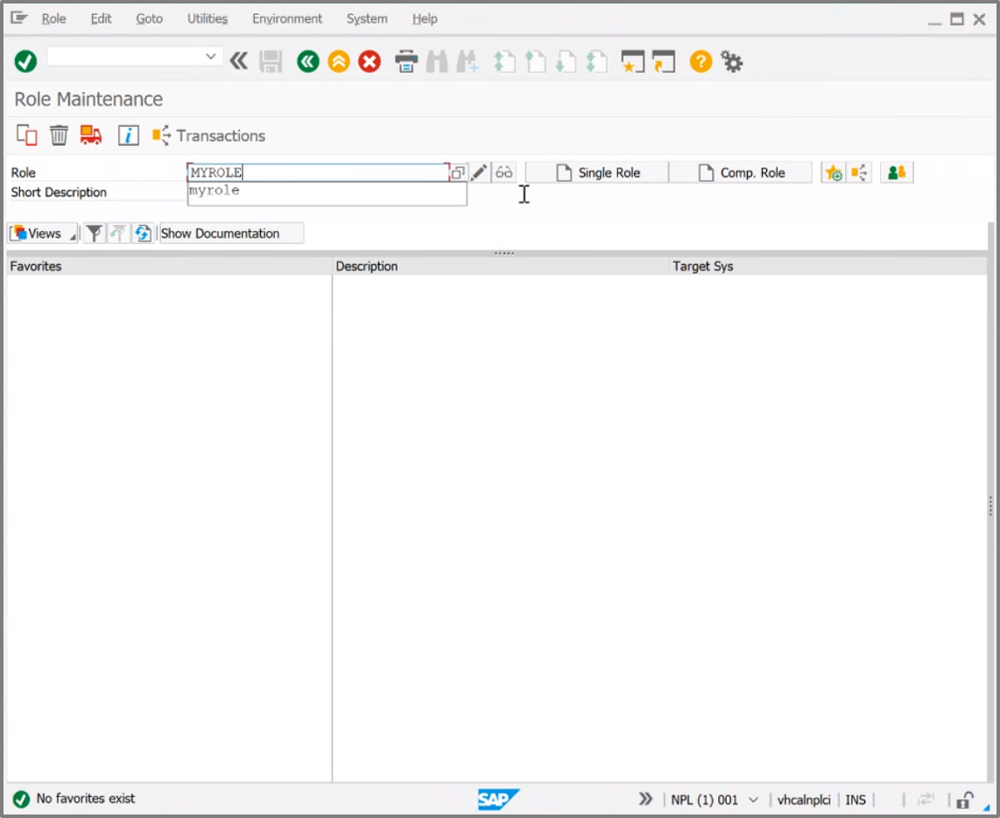
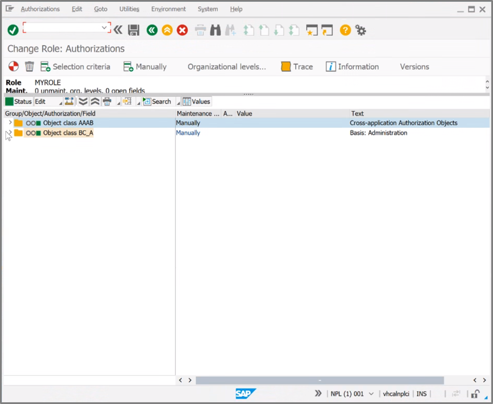
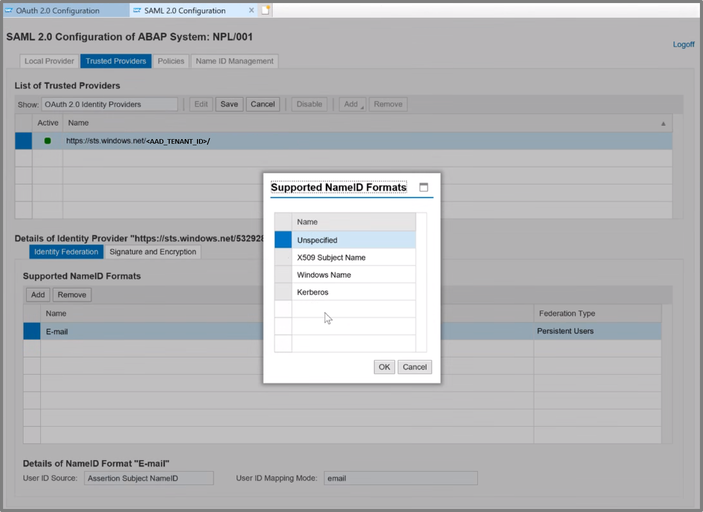

# SAP Configuration

First you will set up SAP so it will be able to exchange token with AAD.

> - Please see a very detailed instruction for configuring SAP to be able to work with the AAD: <br> [Single Sign On - SAP and AAD](https://blogs.sap.com/2019/10/17/single-sign-on-for-abap-engine-with-azure-active-directory-using-oauth/) <br>

> - Below we highlighted the main configuration parts within SAP Netweaver: <br>

|Topic|Description|
|:-----------|:------------------|
|[Generate User](#generate-user)|Generate a Dialog User in the SAP Netweaver System|
|[Federation between SAP and Azure Active Directory](#federation-between-sap-and-azure-active-directory)|Configure federation between SAP and Azure Active Directory|
|[Configure Client in SAP](#configure-client-in-sap)|Configure a Client nwithin the SAP Netweaver System|
|[Configure Scopes in SAP](#configure-scopes-in-sap)|Configure the Scopes to enable access to certain OData Services|


> **Introduction to SAML assertions**
> - The SAML assertion (as discussed [here](../README.md)) needs the correct Audience which is associated with its Condition element. It defines under which security conditions the assertion is valid, such as the earliest and latest time at which it is valid, who can consume the assertion, etc. The audience must match the SAML service provider (SP) value (or EntityID) of SAP Netweaver. 
> - The correct Recipient is associated with the Subject element of the SAML assertion. It uniquely identifies the subject or user between the IDP (AAD) and SAP Netweaver for whom the assertion has been issued and defines the format of the user identifier (e.g. an e-mail address). <br> ```For the user identifier, a dialog User should be generated and the Name ID must be configured``` <br>
> - To ensure the integrity a valid Signature of a trusted IDP is necessary. The IDP (AAD) signs the SAML assertion to proof to SAP Netweaver that only it could have issued the assertion. <br> ```Thus the federation between SAP and AAD must be configured.``` <br>
> - The frontend app requests the SAML assertion for a second application registered in AAD, which represents the SAP Netweaver account. This app is created from the AAD SaaS app gallery as an enterprise app of type “SAP Netweaver”, which allows to configure SSO settings for SAML. Those settings are taken by AAD when it generates the SAML assertion in response to an On Behalf Of request. Details of the app registration and configuration are discussed in the following section: [Azure Active Directory Configuration](../AzureActiveDirectoryConfiguration/README.md) <br>
> - ```In Order to access SAP an OAuth Client and the necessary authorized scopes should be configured as discussed below.```


## Generate User

> Login to the SAP NetWeaver and redirect to the role & rights section by typing the abbreviation for the role maintenance: <br>```PFCG```


> Then you set up a role and a common User ```Jane Doe (JDoe)``` between SAP and Active Directory. <br>
> The type of the user must be a *Dialog User*.<br>
> The role needs some authorizations.





> The user must be assigned to a role authorized for the scopes ```OA2_CLIENT``` and ```OA2_Scope```. <br>
> Hit the ```Authorizations``` button.


> Select the ```Obect class BC_A``` button.



> Open the ```Authorization Object S_SCOPE ``` and the ```Authorization TNL-31000500 ```.


> Select the ```OAuth2 Scope``` and the ```OAuth2 Client``` and give the necessary scopes which you need to access.
> For testing, development purposes we used the "wild card" using the ```*``` in the *From* and *To* areas.


## Federation between SAP and Azure Active Directory

> In order to be able to connect SAP and AAD, there needs to be a federation configured.
> In this part you will configure SAP to trust Azure Active Directory (AAD):
> For this first login with an *Admin User Account*:
    > - Choose for the Url: ```https://<SAPNETWEAVER_IP_ADDRESS>:44300/sap/bc/webdynpro/sap/saml2?TRUSTED_PROVIDER_TYPE=OA2#```


> Then configure as follows:
    > 1. Choose the OAuth-2.0-Identity-Provider: <br> ``` https://sts.windows.net/<AAD_TENANT_ID> ```
    > 2. Configure the NameID format to: *E-mail*




> Then configure SAML-2.0 in SAP NetWeaver


> After this configure the Service-Provider-Settings:


> You can automatically upload the metadata file from the AAD into SAP NetWeaver.

## Configure Client in SAP

> First login into the Client Url: ```https://<SAPNETWEAVER_IP_ADDRESS>:44300/sap/bc/webdynpro/sap/oauth2_config#``` <br>
> Add a new OAuth Client which represents the Application Client:
    > 1. Fill in a *OAuth-2.0-Client-ID* and name it e.g. CLIENT1
    > 2. Check the box *SAML-2.0-Inhaber*
    > 3. Check the box *Aktualisieren*
    > 4. Make sure that the box *attribute client_id* is **not** checked
    > 5. Configure the trustworthy Identityprovider: *OAuth-2.0-IdP*: <br>
    > ``` https://sts.windows.net/<AAD_TENANT_ID> ```


## Configure Scopes in SAP

> Then configure the Scope and select the correct target. <br>
> *(Scroll down the current page.)*
> In our sample we are using: <br>
> ```https://<SAPNETWEAVER_IP_ADDRESS>:44300/sap/opu/odata/iwbep/GWSAMPLE_BASIC/ProductSet```


## Next Steps

> Now let's jump into the section for [configuring Azure Active Directory.](../AzureActiveDirectoryConfiguration/README.md) 