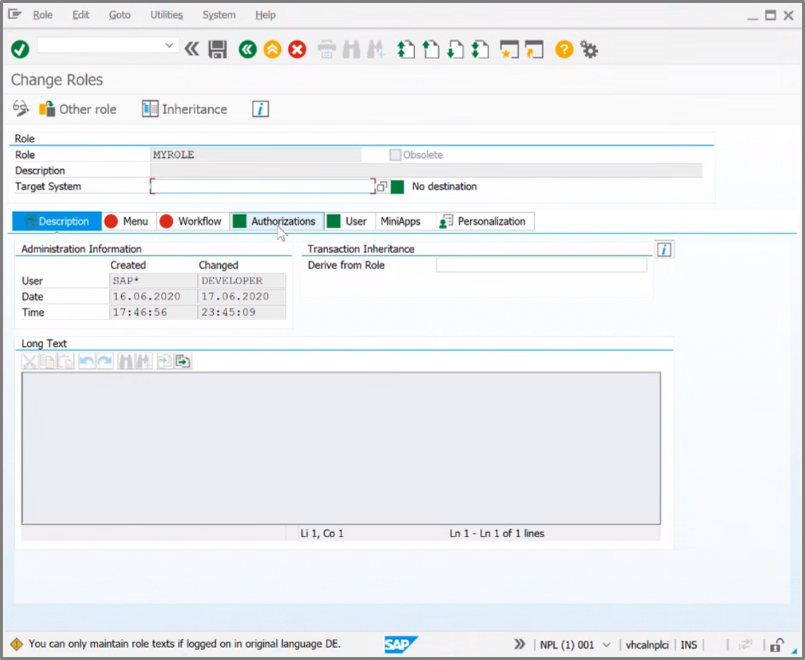
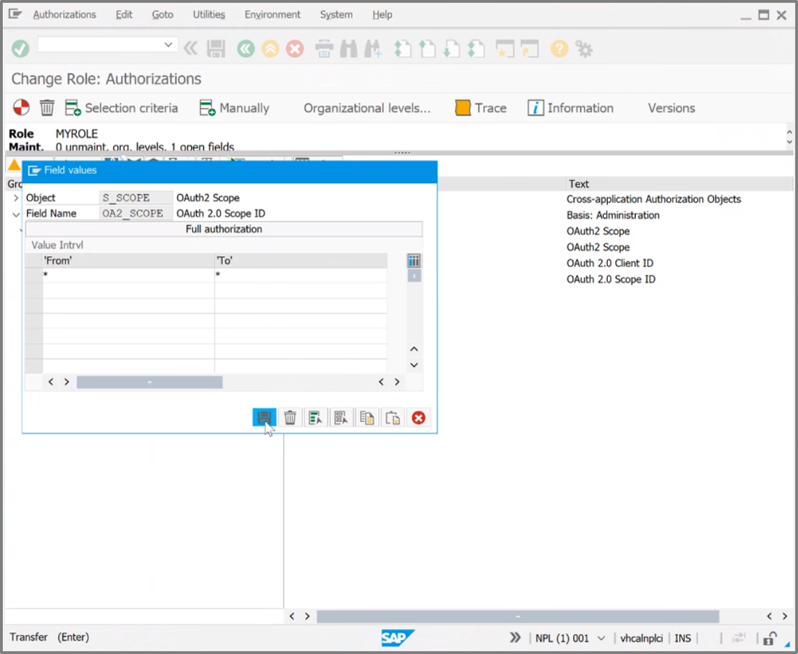
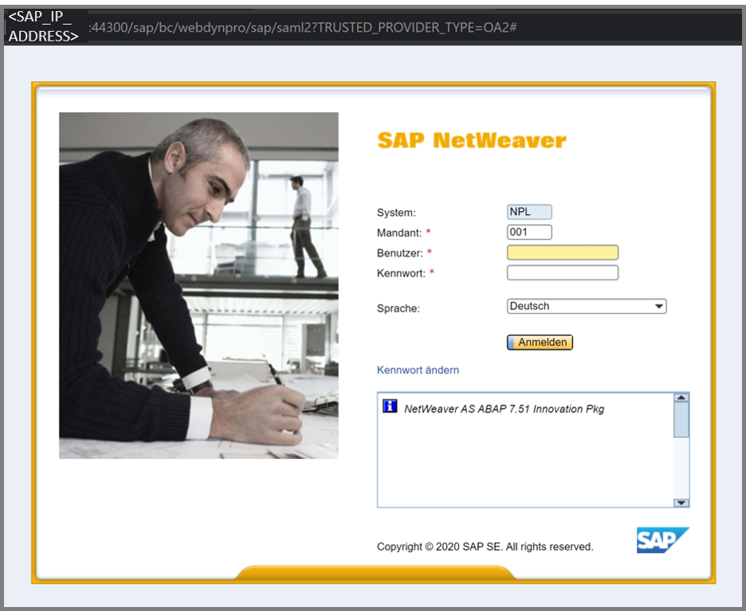

# SAP Configuration

First you will set up SAP to configure the federation between SAP and AAD.

> - Please see a very detailed instruction for configuring SAP to be able to work with the AAD: <br> [Single Sign On - SAP and AAD](https://blogs.sap.com/2019/10/17/single-sign-on-for-abap-engine-with-azure-active-directory-using-oauth/) <br>
> - Below we **highlighted the main configuration parts within SAP Netweaver**: <br>

|Topic|Description|
|:-----------|:------------------|
|[Generate User](#generate-user)|Generate a Dialog User in the SAP Netweaver System|
|[Federation between SAP and Azure Active Directory](#federation-between-sap-and-azure-active-directory)|Configure federation between SAP and Azure Active Directory|
|[Configure Client in SAP](#configure-client-in-sap)|Configure a Client within the SAP Netweaver System|
|[Configure Scopes in SAP](#configure-scopes-in-sap)|Configure the Scopes to enable access to certain OData Services|

## Generate User

> **1.** Login to the SAP NetWeaver and redirect to the role & rights section by typing the abbreviation for the role maintenance: <br>
> ```/nPFCG```


> **2.** Set up a role and a user ```Jane Doe (JDoe)``` which is known by SAP and by the AAD. <br>
> The type of the user must be a *Dialog User*.<br>
> The role needs some authorizations.


>**3.** Hit the ```Authorizations``` button.




>**4.** Select the ```Obect class BC_A``` button.


> **5.** Open the ```Authorization Object S_SCOPE ``` and the ```Authorization TNL-31000500 ```.
> The user must be assigned to a role authorized for the scopes ```OA2_CLIENT``` and ```OA2_Scope```. <br>


> **6.** Select the ```OAuth2 Scope``` and the ```OAuth2 Client``` and give the necessary scopes which you need to access.
> For testing, development purposes we used the "wild card" using the ```*``` in the *From* and *To* areas.



## Federation between SAP and Azure Active Directory

> In order to be able to connect SAP and AAD, there needs to be a federation configured.<br>
> In this part you will configure SAP to trust AAD: <br>
> **1.** For the login use the *Admin User Account*: <br>
    > - Use the following Url: <br> ```https://<SAPNETWEAVER_IP_ADDRESS>:44300/sap/bc/webdynpro/sap/saml2?TRUSTED_PROVIDER_TYPE=OA2#```



> **2.** Then configure as follows:
    > 1. Choose the OAuth-2.0-Identity-Provider: <br> ``` https://sts.windows.net/<AAD_TENANT_ID> ```
    > 2. Configure the NameID format to: *E-mail*


> **3.** Configure SAML-2.0 in SAP NetWeaver


> **4.** After this configure the Service-Provider-Settings:


> **5.** You can automatically upload the metadata file from the AAD into SAP NetWeaver. <br>
> If you have not saved the link to the federation metadata document see a brief description [here](../AzureActiveDirectoryConfiguration/README.md#Download-the-Federation-metadata-document). 

## Configure Client in SAP

> **1.** First login into SAP by using the following Client Url: ```https://<SAPNETWEAVER_IP_ADDRESS>:44300/sap/bc/webdynpro/sap/oauth2_config#``` <br>
> **2.** Add a new OAuth Client which represents the Application Client from the SAP side:
    > 1. Fill in a *OAuth-2.0-Client-ID* and name it e.g. CLIENT1
    > 2. Check the box *SAML-2.0-Inhaber*
    > 3. Check the box *Aktualisieren*
    > 4. Make sure that the box *attribute client_id* is **not** checked
    > 5. Configure the trustworthy Identityprovider: *OAuth-2.0-IdP*: <br>
    > ``` https://sts.windows.net/<AAD_TENANT_ID> ```


## Configure Scopes in SAP

> **1.** Configure the Scope and select the correct target. <br>
> *(Scroll down the current page.)* <br>
> **2.** In our sample we are using: <br>
> ```https://<SAPNETWEAVER_IP_ADDRESS>:44300/sap/opu/odata/iwbep/GWSAMPLE_BASIC/ProductSet```


## Next Steps

> Now let's test the scenario and jump into the section for setting up [Postman](../PostmanSetup/README.md)


# References
> https://wiki.scn.sap.com/wiki/display/Security/Using+OAuth+2.0+from+a+Web+Application+with+SAML+Bearer+Assertion+Flow
> https://blogs.sap.com/2020/07/17/principal-propagation-in-a-multi-cloud-solution-between-microsoft-azure-and-sap-cloud-platform-scp/
