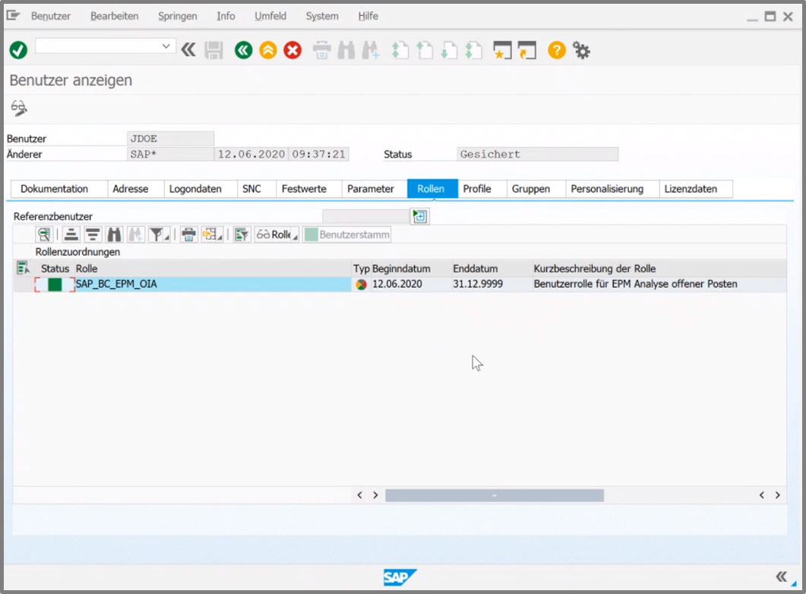
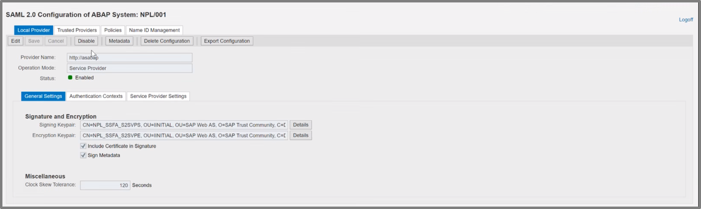
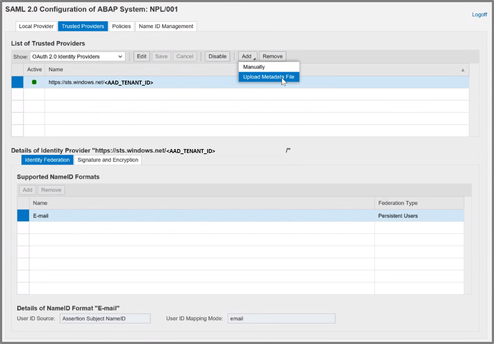

# SAP Configuration

In this part you will configure SAP to trust Azure Active Directory (AAD):

|Topic|Description|
|:-----------|:------------------|
|[Generate User]()|What needs to be done|
|[Federation between SAP and Azure Active Directory]()|What needs to be done|
|[Configure Client in SAP]()|What needs to be done|
|[Configure Scopes in SAP]()|What needs to be done|

## Generate User

First you set up a common user between SAP and Active Directory:


The type of the user must be a *Dialog User*



## Federation between SAP and Azure Active Directory

In order to be able to connect SAP and AAD, there needs to be a federation configured.

For this you first login with an Admin User:
- Choose for the Url: https://SAPNETWEAVER_IP_ADDRESS:44300/sap/bc/webdynpro/sap/saml2?TRUSTED_PROVIDER_TYPE=OA2#


Then you configure the following configuration:

1. You choose the OAuth-2.0-Identity-Provider
2. ``` https://sts.windows.net/<AAD_TENANT_ID> ```
3. Configure NameID format to: *E-mail*


Then you configure SAML-2.0 in SAP NetWeaver



And then you configure the Service-Provider-Settings:



## Configure Client in SAP

First you login into the Client Url: https://<SAPNETWEAVER_IP_ADDRESS>:44300/sap/bc/webdynpro/sap/oauth2_config#

Add a new Client:
1. Fill in a *OAuth-2.0-Client-ID* and name it e.g. CLIENT1
2. Check the box *SAML-2.0-Inhaber*
3. Check the box *Aktualisieren*
4. Make sure that the box *attribute client_id* is **not** checked
5. Configure the trustworthy Identityprovider: *OAuth-2.0-IdP*: <br>
``` https://sts.windows.net/<AAD_TENANT_ID> ```


## Configure Scopes in SAP

Then you configure the Scope and select the correct target. <br>
*(Scroll down the page you are currently on.)*

In our sample we are using: 

```
https://<SAPNETWEAVER_IP_ADDRESS>:44300/sap/opu/odata/iwbep/GWSAMPLE_BASIC/ProductSet

```

