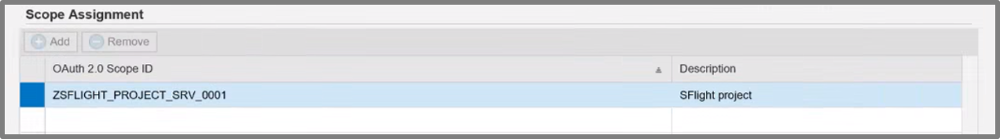

# SAP Configuration

> **Introduction**
> The SAML Assertion (as discussed [here](../README.md)) needs the correct Audience which is associated with the Condition element of the SAML assertion. It defines under which security conditions the assertion is valid, such as the earliest and latest time instant before it expires, who can consume the assertion, etc. The Audience must match the SAML service provider (SP) value (or EntityID) of SAP Netewaver. <br> ```Thus a dialog User must be generated``` <br>
> The correct Recipient which is associated with the Subject element of the SAML assertion. It uniquely identifies the subject or user between the IDP (AAD) and SAP Netweaver for whom the assertion has been issued, defines the format of the user identifier (e.g. an e-mail address). `<br> ```Thus the Name ID must be configured``` <br>
> To ensure the integrity a valid signature of a trusted IDP is necessary. The IDP (AAD) signs the SAML assertion to proof to SAP Netweaver that only could have issued the assertion. <br> ```Thus the federation between SAP and AAD must be configured.``` <br>
> The frontend app requests the SAML assertion for a second application registered in AAD, which represents the SAP Netweaver account. This app is created from the AAD SaaS app gallery as an enterprise app of type “SAP Netweaver”, which allows to configure SSO settings for SAML. Those settings are taken by AAD when it generates the SAML assertion in response to an On Behalf Of flow request. Details of the app registration and configuration are discussed in the following section: [Azure Active Directory Configuration](../AzureActiveDirectoryConfiguration/README.md) <br>
> ```In Order to access SAP a Client and the Scopes should be configured as discussed below.```


## Prerequisites
Please see a very detailed instruction for Configuring SAP to be able to work with the AAD: [Single Sign On - SAP and AAD](https://blogs.sap.com/2019/10/17/single-sign-on-for-abap-engine-with-azure-active-directory-using-oauth/)

Below we highlighted the main configuration parts within SAP Netweaver:
|Topic|Description|
|:-----------|:------------------|
|[Generate User]()|A Dialog User needs to be generated in the SAP System.|
|[Federation between SAP and Azure Active Directory]()|A federation needs to be configured between SAP and Azure Active Directory|
|[Configure Client in SAP]()|A Client needs to be configured within the SAP|
|[Configure Scopes in SAP]()|The Scopes need to be configured to be able to access certain OData Services|


## Generate User

First you set up a common User ```Jane Doe (JDoe)```between SAP and Active Directory:


The type of the user must be a *Dialog User*


## Federation between SAP and Azure Active Directory

In order to be able to connect SAP and AAD, there needs to be a federation configured.
In this part you will configure SAP to trust Azure Active Directory (AAD):

For this you first login with an *Admin User Account*:

- Choose for the Url: https://SAPNETWEAVER_IP_ADDRESS:44300/sap/bc/webdynpro/sap/saml2?TRUSTED_PROVIDER_TYPE=OA2#


Then you configure the following configuration:

1. You choose the OAuth-2.0-Identity-Provider
2. ``` https://sts.windows.net/<AAD_TENANT_ID> ```
3. Configure NameID format to: *E-mail*


Then you configure SAML-2.0 in SAP NetWeaver


And then you configure the Service-Provider-Settings:


## Configure Client in SAP

First you login into the Client Url: https://<SAPNETWEAVER_IP_ADDRESS>:44300/sap/bc/webdynpro/sap/oauth2_config#

Add a new Client:
1. Fill in a *OAuth-2.0-Client-ID* and name it e.g. CLIENT1
2. Check the box *SAML-2.0-Inhaber*
3. Check the box *Aktualisieren*
4. Make sure that the box *attribute client_id* is **not** checked
5. Configure the trustworthy Identityprovider: *OAuth-2.0-IdP*: <br>
``` https://sts.windows.net/<AAD_TENANT_ID> ```


## Configure Scopes in SAP

Then you configure the Scope and select the correct target. <br>
*(Scroll down the page you are currently on.)*

In our sample we are using: 

```
https://<SAPNETWEAVER_IP_ADDRESS>:44300/sap/opu/odata/iwbep/GWSAMPLE_BASIC/ProductSet

```




## Next Steps

Now let's jump into the section for [configuring Azure Active Directory.](../AzureActiveDirectoryConfiguration/README.md) 