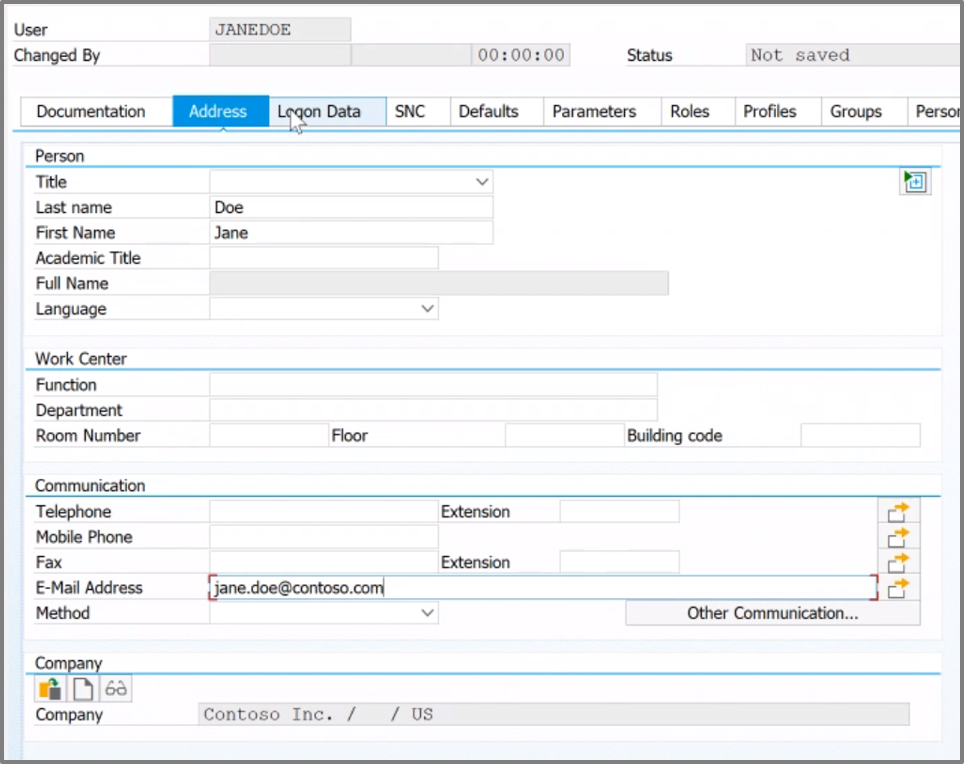
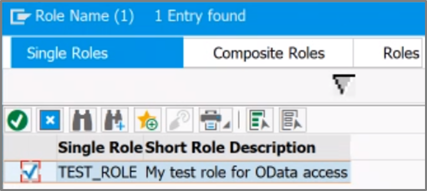

# SAP NetWeaver Configuration

## Prerequisites

First you will set up SAP to configure the federation between SAP and AAD.

> - Please see a very detailed instruction for configuring SAP to be able to work with the AAD: <br> [Single Sign On - SAP and AAD](https://blogs.sap.com/2019/10/17/single-sign-on-for-abap-engine-with-azure-active-directory-using-oauth/) <br>
> - Below we **highlighted the main configuration parts within SAP Netweaver**: <br>

</br>

## Generate Role

1. Login to the SAP NetWeaver and redirect to the role & rights section by typing the abbreviation for the role maintenance:
```/nPFCG```


2. Navigate to **Role Maintenance** create a **Single Role** and name it **TEST_ROLE**.


3. Add a description, **Save** the newly created role and navigate to **Authorizations**. There change the authorization data.


4. Do not select any of the shown templates. Select **Manually** in the upper bar to create two authorization objects.


5. Create two new authorization objects **S_SERVICE** and **S_SCOPE** <br>
as the user must be assigned to a role authorized for the scopes **OA2_CLIENT** and **OA2_Scope** later on.


6. Unfold the folders down to the scopes and change the **Authorization** values of these four scopes. </br>
For testing, development purposes we used the "wild card" using the **"*"** in the **From** and **To** areas. The final overview should look like this:


7. Select **Generate** in the upper bar. The Status of the role should change from **Saved** to **generated**.


## Generate Users

1. Redirect to the User Maintenance section by using:
```/nSU01```


2. Set up a user **Jane Doe (JDoe)** which is known by SAP and by the AAD. <br>
Select **Create**.


3. Configure the users **Address** information. 
> [!CAUTION] The e-mail address should be the same in the AAD. </br>
> As we are using the mail address to match the users between AAD and SAP this is critical.



4. Now the role created before is assigned to the user. Navigate to **Roles** and add a **Role Assignment**.


5. Search for the **Single Role** named **TEST_ROLE** and select the role created by you. **Confirm** the selection by pressing the green checkmark. Save these changes using the disk symbol in the upper bar.



6. Navigate to **Logon Data** and create a new password for the user. Save this password to the notepad. </br>
Make sure the **User Type** is **Dialog User**. Save all changes.


7. Create a new User. Name it **Client1**.


8. Configure this users **Logon Data** so that **User Type** is **System** and create a password for the user. Save the password to the notepad.


## Federation between SAP and Azure Active Directory

In order to be able to connect SAP and AAD, there needs to be a federation configured.<br>
In this part you will configure SAP to trust AAD: <br>

1. Redirect to the SAML 2.0 Configuration by using:
```/nSAML2```


2. Navigate to **Trusted Providers** in the upper bar. There show the **OAuth 2.0 Identity Providers**.


3. Upload the **metadata file** of the SAPNetWeaver application downloaded during the AAD configuration and confirm the next steps.
> If you have not downloaded the federation metadata document see a brief description [here](../AzureActiveDirectoryConfiguration/README.md#Download-the-Federation-metadata-document). 


4. The **Provider Name** should set to ```https://sts.windows.net/<AAD_TENANT_ID>``` automatically. Finish the OAuth 2.0 Identity Provider setup.


5. **Edit** the created trusted provider.


6. Under **Identity Federation** press **Add** and select **E-mail**. Confirm with **OK**.


7. Press **Enable** to finalize the Setup of AAD as new trusted provider for SAP NetWeaver.


## Configure the Scope for OAuth 2.0

1. Redirect to the Activate and Maintain Services section by using:
```/n/IWFND/MAINT_SERVICE```

 

2. Look for **ZGWSAMPLE_BASIC** and **GWSAMPLE_BASIC** under **Technical Servicename**. Check the **OAuth** box for both scopes.

 

## Configure Client in SAP

1. Redirect to the OAuth 2.0 Administration by using:
```/nSOAUTH2```

 

2. Add a new OAuth Client which represents the Application Client from the SAP side by selecting **Create**. Now search for **CLIENT1** which was previously created. Add a Description and press **Next**.


3. Check the box **Client User ID and Password** in the **Client Authentication** section and move on to the next section.

4. Check the box **Grant Type SAML 2.0 Bearer Assertion** in the **Resource Owner Authentication** section. Add ```https://sts.windows.net/<AAD_TENANT_ID>``` as **Trustes OAuth 2.0 IdP** by searching for it and than confirming. Move on to the next section.


5. Add **Scope Assignments** by searching for and adding **BW_BICS_INA**, **GWSAMPLE_BASIC** and **ZGWSAMPLE_BASIC**. Finish the new Client creation.

6. Next check the client settings. Most should be already configured right.
    1. Check the box **SAML 2.0 Bearer**
    2. Check the box **Client User ID and Password**
    3. Check the box **Grant Type SAML 2.0**
    4. Configure the trustworthy Identityprovider: **OAuth-2.0-IdP**: <br>
    ``` https://sts.windows.net/<AAD_TENANT_ID> ```
    5. Make sure that the box **Requires Attribute "client_id"** is **not** checked


## Next Steps

Now let's test the scenario and jump into the section for setting up [Postman](../PostmanSetup/README.md)

## Additional resources

- [ List of Tutorials on How to Integrate SaaS Apps with Azure Active Directory ](https://docs.microsoft.com/azure/active-directory/active-directory-saas-tutorial-list)

- [What is application access and single sign-on with Azure Active Directory? ](https://docs.microsoft.com/azure/active-directory/active-directory-appssoaccess-whatis)

- [What is conditional access in Azure Active Directory?](https://docs.microsoft.com/azure/active-directory/conditional-access/overview)

- [Try Visibly with Azure AD](https://aad.portal.azure.com/)

- [What is session control in Microsoft Cloud App Security?](https://docs.microsoft.com/cloud-app-security/proxy-intro-aad)
- https://blogs.sap.com/2020/07/17/principal-propagation-in-a-multi-cloud-solution-between-microsoft-azure-and-sap-cloud-platform-scp/
- https://wiki.scn.sap.com/wiki/display/Security/Using+OAuth+2.0+from+a+Web+Application+with+SAML+Bearer+Assertion+Flow
